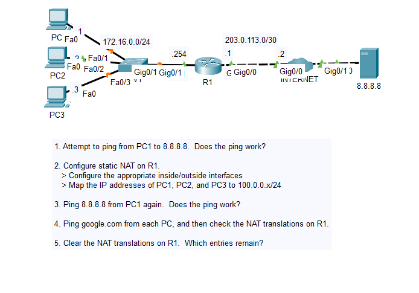
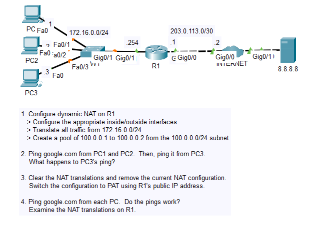

# 1. NAT là gì?
NAT viết tắt của Network Address Translation, là một kỹ thuật chuyển đổi giữa IP Private và IP Public. Quá trình chuyển đổi này hỗ trợ các thiết bị trong mạng cục bộ truy cập dễ dàng vào Internet.
# 2. Chức của chính của NAT trong hệ thống mạng
Trong một hệ thống mạng, NAT đóng vai trò di chuyển gói tin giữa các lớp mạng khác nhau. Cụ thể, NAT tiến hành chuyển đổi địa chỉ IP trong từng gói tin và chuyển đến Router cùng một số thiết bị mạng khác.

Trong quá trình chuyển đổi gói tin từ mạng Internet ngược lại NAT, NAT cần thay đổi dạng IP đích (IP Public) sang dạng IP Private và sau đó chuyển đi.

NAT còn hoạt động như một tường lửa, hỗ trợ bảo mật IP của thiết bị. NAT giúp tiết kiệm địa chỉ IP bằng cách sử dụng một địa chỉ IP Public duy nhất để đại diện cho nhiều thiết bị trong mạng nội bộ.
# 3. Một số thuật ngữ dùng trong NAT
- **Inside Local:** Địa chỉ IP ứng với mỗi thiết bị nằm trong mạng nội bộ nhưng không cung cấp bởi Network Information Center, thường là IP Private.
- **Inside Global:** Kiểu địa chỉ IP đăng ký tại Network Information Center. Đây là địa chỉ phù hợp để thay thế cho IP Inside local.
- **Outside Global:** Địa chỉ IP ứng với thiết bị hoạt động tại hệ thống mạng bên ngoài, hoàn toàn hợp lệ với mạng internet.
# 4. Phân loại NAT
## 4.1 Static NAT
Static NAT là kỹ thuật biến đổi từ IP này qua IP khác được thực hiện thủ công bằng cách cố định một IP Private qua một IP Public. 

Khi một lưu lượng được gửi đi từ địa chỉ IP Private của mạng cục bộ ra ngoài, bộ định tuyến sẽ tiến hành thông dịch địa chỉ IP Private đấy.

Khi một lưu lượng đi từ Internet tới địa chỉ inside global của thiết bị trong mạng cục bộ, router sẽ thông dịch địa chỉ đấy về địa chỉ IP Private và gửi gói tin về tới đích.
## 4.2 Dynamic NAT
### 4.2.1 Dynamic NAT - Dynamic Network Address Translation
Dynamic NAT là kỹ thuật biến đổi từ IP này qua IP khác nhưng được router thực hiện một cách tự động. Router sẽ thực hiện kết nối giữa địa chỉ inside local với địa chỉ inside global, và tiến hành thông dịch qua địa chỉ outside local kết nối đến Internet.

ACL (Access List) được sử dụng để xác định mạng nào được cho phép thông dịch qua router.

NAT pool (bể chứa NAT) dùng để xác định những địa chỉ inside global có sẵn có thể sử dụng.
### 4.2.2 Dynamic PAT - Dynamic Port Address Translation
Khi sử dụng dynamic NAT, có thể gặp tình trạng "NAT pool exhaustion" tức là không có đủ inside global trong NAT pool có sẵn để sử dụng. Dynamic PAT giải quyết vấn đề đó bằng cách kèm theo các địa chỉ inside global là các port number. Từ đó, một địa chỉ inside global có thể được sử dụng với nhiều host khác nhau.

Port number tồn tại trong TCP/UDP header với độ dài 2 bytes (16 bit), tương đương với hơn 65000 port number có thể sử dụng kèm theo các địa chỉ inside global.
# 5. Đánh giá ưu, nhược điểm của NAT
## 5.1 Ưu điểm
NAT giúp tiết kiểm địa chỉ IPv4.

NAT giúp chia sẻ tài nguyên kết nối Internet cho nhiều thiết bị trong cùng một mạng LAN thông qua một IP Public.

## 5.2 Nhược điểm
NAT khiến công việc CPU thực hiện tăng lên do phải hoạt động liên tục để thay đổi địa chỉ IP. Từ đó, khiến cho độ trễ trong switching tăng, ảnh hưởng đến tốc độ đường truyền mạng.

# 6. LAB
## 6.1 Static NAT

Các bước tiến hành thực hiện bài lab:

- Bước 1: Khai báo cổng nat inside và outside của router

- Bước 2: Cấu hình địa chỉ inside local với địa chỉ inside global 

- Bước 3: Kiểm tra bảng ip nat translations

- Bước 4: Tiến hành ping và kiểm tra lại bảng ip nat translations

## 6.2 Dynamic NAT

Các bước tiến hành thực hiện bài lab:
- Bước 1: Khai báo cổng nat inside và outside của router tương tự như static nat

- Bước 2: Cấu hình access-list permitted cho mạng
- Bước 3: Cấu hình nat pool 
- Bước 4: Kết nối access-list permitted với nat pool

- Bước 5: Ping và kiểm tra bảng ip nat translations
