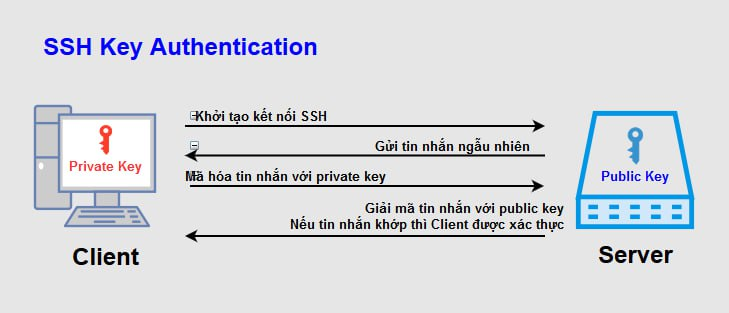

# 1. SSH key là gì?
Khóa SSH là một thông tin xác thực truy cập an toàn được sử dụng trong giao thức Secure Shell (SSH). Cặp khóa SSH sử dụng công nghệ cơ sở hạ tầng khóa công khai (PKI), vì giao thức SSH được sử dụng rộng rãi cho giao tiếp trong các dịch vụ đám mây, môi trường mạng, công cụ truyền tệp, công cụ quản lý cấu hình và các dịch vụ phụ thuộc vào máy tính khác, hầu hết các tổ chức sử dụng phương pháp xác thực dựa trên khóa này để xác minh danh tính và bảo vệ các dịch vụ khỏi việc sử dụng ngoài ý muốn hoặc các cuộc tấn công độc hại.

Khóa SSH sử dụng một khóa công khai và một khóa riêng tư, cùng tạo thành một cặp khóa được sử dụng như thông tin xác thực truy cập an toàn.

  - Khóa riêng tư là thông tin bí mật, chỉ được biết đến bởi người dùng, và cần được mã hóa cũng như lưu trữ an toàn.
  - Khóa công khai có thể được chia sẻ tự do với bất kỳ máy chủ SSH nào mà người dùng muốn kết nối.

Để tạo danh tính số, cả khóa công khai và khóa riêng tư đều được tạo ra, và cặp khóa này được liên kết với nhau bằng một thuật toán mã hóa khóa công khai mạnh mẽ. Thuật toán RSA là một thuật toán phổ biến được sử dụng. 

# 2. Cách SSH keypair hoạt động
Cặp khóa SSH được sử dụng để xác thực danh tính của một người dùng hoặc tiến trình muốn truy cập vào hệ thống từ xa bằng giao thức SSH. Khóa công khai được cả người dùng và máy chủ từ xa sử dụng để mã hóa các thông điệp. Ở phía máy chủ từ xa, khóa công khai được lưu trong một tệp khóa công khai. Ở phía người dùng, khóa này được lưu trữ trong phần mềm quản lý khóa SSH hoặc trong một tệp trên máy tính của họ. Khóa riêng tư chỉ được giữ trên hệ thống đang sử dụng để truy cập máy chủ từ xa và được dùng để giải mã thông điệp.

- **Khởi tạo kết nối SSH:** Client yêu cầu kết nối đến Server bằng giao thức SSH.
- **Gửi tin nhắn ngẫu nhiên từ Server:** Server tạo một tin nhắn ngẫu nhiên (random message) và gửi nó đến Client.
- **Mã hóa tin nhắn với Private Key:** Client sử dụng Private Key của mình để mã hóa tin nhắn ngẫu nhiên vừa nhận được từ Server.
- **Giải mã tin nhắn với Public Key:** Server sử dụng Public Key (đã được Client cung cấp trước đó) để giải mã tin nhắn từ Client. Nếu tin nhắn giải mã khớp với tin nhắn ban đầu (tin nhắn ngẫu nhiên), Server xác thực rằng Client là hợp lệ.
# 3. Cách tìm SSH keypair trong hệ thống
- Đi tới thư mục cá nhân và tìm thư mục SSH:

   - Trên Linux và MacOS: Thư mục mặc định là ~/.ssh.
   - Trên Windows: Thư mục mặc định là C:\Users\<tên người dùng>\.ssh.

- Tìm cặp tệp khóa SSH:
   - Tìm hai tệp có tên tương tự như id_dsa hoặc id_rsa.
   - Một tệp sẽ có phần mở rộng .pub (ví dụ: id_rsa.pub) là tệp chứa khóa công khai và tệp kia sẽ không có (ví dụ: id_rsa) là tệp chứa khóa riêng tư.
# 4. Cách tạo ra SSH keypair
- Mở terminal và chạy dòng lệnh: ssh-keygen -t rsa
- Chọn vị trí lưu trữ cho tệp khóa: 

   - Hệ thống sẽ hỏi vị trí lưu trữ khóa:
   
      Enter file in which to save the key (/home/username/.ssh/id_rsa):

    -  Mặc định, khóa sẽ được lưu trong thư mục ~/.ssh/ (Linux/MacOS) hoặc C:\Users\<username>\.ssh\ (Windows). Nhấn Enter để chấp nhận hoặc chỉ định đường dẫn khác.
-  Hệ thống sẽ yêu cầu nhập passphrase:

   Enter passphrase (empty for no passphrase):

   Passphrase giúp bảo vệ khóa riêng tư bằng một lớp mật khẩu bổ sung, có thể để trống nếu không muốn sử dụng passphrase.

- Sau khi nhập, hệ thống sẽ tạo cặp khóa. Ví dụ:
 
  Your identification has been saved in /home/username/.ssh/id_rsa

  Your public key has been saved in /home/username/.ssh/id_rsa.pub

