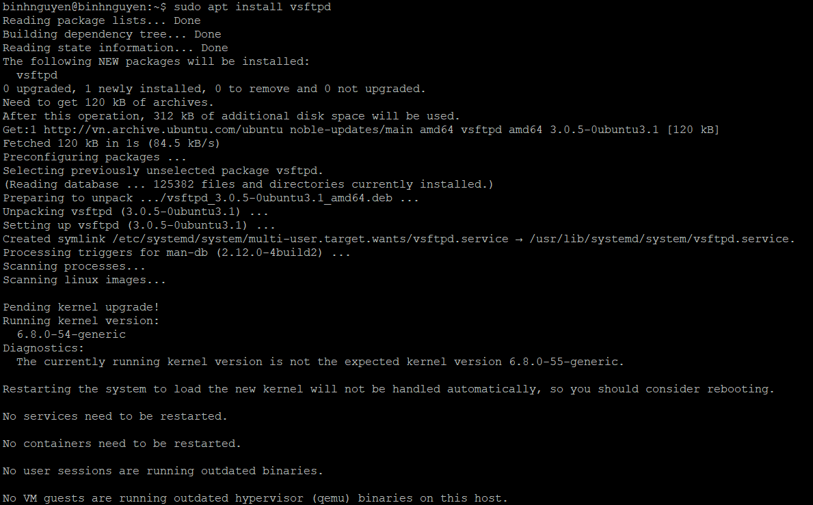
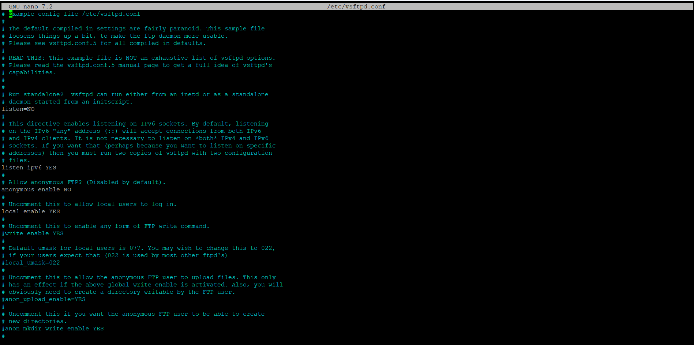

# CẤU HÌNH FTP SERVER TRÊN UBUNTU 24.04 VỚI VSFTPD
# 1. Quy trình xây dựng một máy chủ FTP
- **Chọn nền tảng máy chủ:** 
   - Chọn một hệ điều hành phù hợp để cài đặt và chạy máy chủ FTP. Các lựa chọn phổ biến bao gồm Linux (ví dụ: Ubuntu, centos) hoặc Windows Server.
   
- **Cài đặt phần mềm máy chủ FTP:**
   - Trên Linux, bạn có thể sử dụng các phần mềm như vsftpd, proftpd, hoặc Pure-ftpd.
   - Trên Windows Server, bạn có thể sử dụng dịch vụ FTP tích hợp hoặc phần mềm như filezilla Server.
- **Cấu hình máy chủ FTP Server:**
   - Thiết lập cấu hình của máy chủ FTP để xác định thư mục gốc (root directory) và quyền truy cập. Bạn cần xác định các nguyên tắc bảo mật và cấu hình tường lửa nếu cần.
- **Tạo người dùng và phân quyền:**
   - Tạo các tài khoản người dùng và phân quyền truy cập đến các thư mục trên máy chủ FTP.
- **Mở cổng truy cập:**
   - Nếu máy chủ của bạn đứng sau tường lửa, hãy chắc chắn rằng cổng truy cập FTP (thông thường là cổng 21) đã được mở và chuyển tiếp đến máy chủ FTP.
- **Kiểm tra kết nối:**
   - Sau khi cài đặt và cấu hình máy chủ FTP, hãy thử kết nối từ một máy khách sử dụng một chương trình FTP client để đảm bảo mọi thứ hoạt động chuẩn xác.

# 2. Cài đặt FTP Server
## 2.1 Cập nhật Ubuntu 22.04
```
sudo apt update && sudo apt upgrade
```
## 2.2 Cài đặt VSFTPD lên Ubuntu 22.04
```
sudo apt install vsftpd
```


## 2.3 Kiểm tra VSFTPD đã active
```
systemctl status vsftpd --no-pager -l
```


# 3. Cấu hình FTP Server
Cấu hình vsftpd bằng cách mở và chỉnh sửa file cấu hình:
```
sudo nano /etc/vsftpd.conf
```


Để giới hạn chỉ cho người dùng nội bộ truy cập vào FTP thì bạn thêm dòng cấu hình sau:
```
anonymous_enable=NO
local_enable=YES
```
Bạn cần cho phép quyền ghi để có thể kích hoạt chức năng upload trên FTP Server. Để làm điều đó, uncomment dòng sau:
```
write_enable=YES
```
Tiếp theo cần giới hạn người dùng chỉ có thể thao tác trên thư mục cụ thể. Để làm điều đó, bạn cần uncomment dòng sau:
```
chroot_local_user=YES
allow_writeable_chroot=YES
```
vsftpd có thể sử dụng bất kì port nào cho các kết nối passive FTP. Vi vậy nên chúng ta thực hiện cấu hình minimum port và maximum port với dòng cấu hình sau:
```
pasv_min_port=35000
pasv_max_port=40000
```
Cuối cùng là để giới hạn những người dùng nào có thể đăng nhập vào FTP Server, thêm đoạn cấu hình sau:
```
userlist_enable=YES
userlist_file=/etc/vsftpd.userlist
userlist_deny=NO
```
# 4. Truy cập FTP 
## 4.1 Tạo user local
Tạo người dùng mới:
```
sudo adduser thanhbinh
```
Tiếp theo bạn cần thêm người dùng mới tạo vào danh sách người dùng của FTP:
```
echo "thanhbinh" | sudo tee -a /etc/vsftpd.userlist
```
## 4.2 Cấp quyền truy cập đến FTP server

Sau khi thêm vào danh sách, bạn hãy tạo thư mục cho người dùng đó:
```
sudo mkdir /home/thanhbinh/ftp
sudo chown nobody:nogroup /home/thanhbinh/ftp
sudo chmod a-w /home/thanhbinh/ftp
```
Sau khi tạo xong thư mục, kiểm tra lại quyền thư mục như sau
```
sudo ls -al /home/thanhbinh/ftp
```


Tiếp theo, bạn cần tạo thư mục có quyền write để có thể lưu các file tải lên:
```
sudo mkdir /home/thanhbinh/ftp/upload
sudo chown thanhbinh:thanhbinh /home/thanhbinh/ftp/upload
```

Lúc đó, thư mục dành cho việc tải lên sẽ có quyền như bên dưới:
```
sudo ls -al /home/thanhbinh/ftp
```


Để tiện cho việc test thử, bạn nên tạo một file test.txt ttrong thư mục upload:
```
echo "vsftpd test file" | sudo tee /home/thanhbinh/ftp/upload/test.txt
```
## 4.3 Kiểm tra kết nối FTP
Thử truy cập FTP Server bằng cmd trên Windows:


Kết nối tới FTP server được thực hiện thành công.

Tài liệu tham khảo:

(https://fptshop.com.vn/tin-tuc/danh-gia/ftp-la-gi-167440)

(https://oneit.com.vn/2023/10/02/cach-cai-dat-vsftpd-de-thiet-lap-ftp-server-tren-ubuntu-22-04/)

