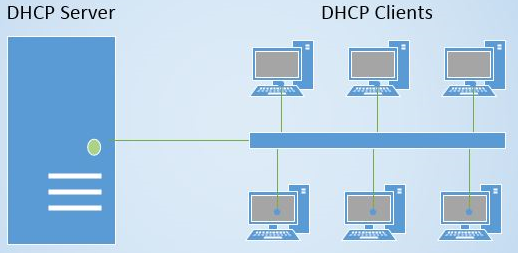
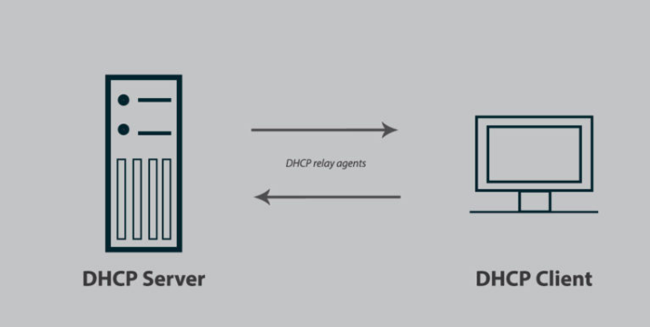
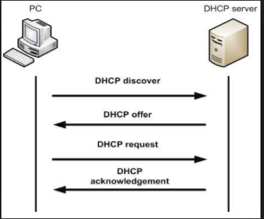

# TÌM HIỂU VỀ DHCP
# 1. DHCP là gì?
DHCP là viết tắt của Dynamic Host Configuration Protocol, một giao thức cho phép máy chủ cấu hình động tự động, cung cấp địa chỉ IP cùng với các thông số cấu hình mạng như Subnet Mask, Gateway, và DNS Server cho các thiết bị trong mạng.

DHCP giao tiếp bằng UDP và sử dụng port 67 và 68. DHCP server sử dụng port 67 để nghe thông tin từ các client và sử dụng port 68 để reply thông tin.

# 2. DHCP để làm gì?
Giao thức DHCP giúp cung cấp các địa chỉ IP để chúng ta có thể truy cập internet. Mục đích quan trọng nhất của giao thức này là tránh xảy ra trường hợp hai máy tính khác nhau sử dụng cùng một địa chỉ IP. Trong trường hợp máy tính không sử dụng giao thức này, ta có thể cấu hình địa chỉ IP thủ công (còn được gọi là cấu hình IP tĩnh). Hiện nay, giao thức này có hai phiên bản sử dụng cho IPv4 và IPv6.

# 3. Các thành phần trong giao thức DHCP
## 3.1 DHCP Server
DHCP Server là máy chủ hoặc thiết bị chịu trách nhiệm cấp phát địa chỉ IP và thông số mạng cho các DHCP Client. Nó lưu trữ một dải địa chỉ IP để phân phối, đồng thời quản lý thông tin thuê địa chỉ IP (DHCP Lease). Ngoài ra, DHCP Server cung cấp các thông tin mạng quan trọng như Subnet Mask, Gateway, và DNS Server, đảm bảo các thiết bị trong mạng có thể kết nối và giao tiếp một cách hiệu quả.

## 3.2 DHCP Client
DHCP Client là thiết bị yêu cầu và nhận thông tin cấu hình mạng từ DHCP Server. Các thiết bị như máy tính, điện thoại, hoặc máy in đóng vai trò làm DHCP Client khi cần kết nối mạng. Chúng gửi yêu cầu để nhận địa chỉ IP và các thông số mạng như Subnet Mask, Gateway, và DNS Server. Sau khi nhận được thông tin từ DHCP Server, DHCP Client sử dụng các thông số này để kết nối và giao tiếp trong mạng.

## 3.3 DHCP Relay agents
DHCP Relay Agents là các thiết bị trung gian, đảm nhiệm vai trò chuyển tiếp gói tin DHCP giữa Client và Server khi chúng không nằm trong cùng một mạng (khác Subnet). Relay Agent nhận các gói tin từ DHCP Client trong mạng con và chuyển tiếp chúng đến DHCP Server. Sau khi Server phản hồi, Relay Agent gửi lại thông tin cho Client. Thành phần này rất hữu ích trong các hệ thống mạng lớn, nơi DHCP Server không được triển khai trong từng mạng con.

## 3.4 DHCP Lease
DHCP Lease là khoảng thời gian mà DHCP Server cấp phát địa chỉ IP cho một thiết bị cụ thể. Thời gian thuê này được quản lý để tối ưu hóa việc sử dụng tài nguyên địa chỉ IP trong mạng. Khi thời gian thuê sắp hết, DHCP Client có thể yêu cầu gia hạn để tiếp tục sử dụng địa chỉ IP đó. Nếu không có yêu cầu gia hạn, địa chỉ IP sẽ được giải phóng và tái sử dụng cho thiết bị khác, giúp đảm bảo việc quản lý IP hiệu quả.

## 3.5 DHCP Binding
DHCP Binding là bản ghi lưu trữ trong DHCP Server, chứa thông tin ánh xạ giữa địa chỉ IP được cấp và địa chỉ MAC của thiết bị nhận. Đây là cơ chế giúp DHCP Server ghi lại các thông tin cấp phát, đảm bảo tính nhất quán và minh bạch trong quản lý mạng. Ngoài ra, DHCP Binding cũng hỗ trợ cấp phát địa chỉ IP cố định (Reservation) dựa trên địa chỉ MAC của thiết bị, rất hữu ích cho các thiết bị cần sử dụng một IP cụ thể, chẳng hạn như máy in hoặc máy chủ trong mạng.
    
# 4. Nguyên lý hoạt động của DHCP
DHCP hoạt động dựa trên cơ chế Client-Server, trong đó các thiết bị (Client) gửi yêu cầu để nhận cấu hình mạng từ một máy chủ DHCP (DHCP Server). Quá trình này bao gồm 4 bước chính, được gọi là DORA:

- **Bước 1: Discovery (Tìm kiếm máy chủ DHCP)**
  
  Khi một thiết bị (Client) kết nối vào mạng lần đầu, nó không có địa chỉ IP. Client sẽ gửi một gói tin DHCPDISCOVER dưới dạng broadcast (phát tán toàn mạng) để tìm kiếm DHCP Server. Gói tin này chứa:

  - Địa chỉ nguồn (Source Address) là 0.0.0.0
  - Địa chỉ đích (Destination Address) là 255.255.255.255.
 
  Mục đích là để thông báo cho tất cả các thiết bị trong mạng rằng nó cần một địa chỉ IP.

- **Bước 2: Offer (Đề nghị cấp phát địa chỉ IP)**
   
   Khi DHCP Server nhận được gói DHCPDISCOVER, nó sẽ phản hồi bằng một gói tin DHCPOFFER. Gói tin DHCPOFFER được gửi đến địa chỉ MAC của Client. Gói tin này bao gồm:

   - Địa chỉ IP tạm thời được đề nghị cho Client.
   - Thông tin mạng như Subnet Mask, Default Gateway, DNS Server, và thời gian thuê địa chỉ IP (Lease Time).

- **Bước 3: Request (Yêu cầu sử dụng địa chỉ IP)**

   Sau khi nhận được gói tin DHCPOFFER, Client sẽ gửi một gói tin DHCPREQUEST để chấp nhận địa chỉ IP mà DHCP Server đề nghị. Gói tin này xác nhận rằng Client muốn sử dụng địa chỉ IP được cấp. Đồng thời, Client cũng gửi yêu cầu xác nhận các thông tin khác như Subnet Mask, Gateway, DNS.

- **Bước 4: Acknowledgement (Xác nhận)**

   DHCP Server gửi gói tin DHCPACK để xác nhận rằng địa chỉ IP đã được cấp phát thành công cho Client. Gói tin này cũng bao gồm thời gian thuê địa chỉ IP (Lease Time) và các thông tin cấu hình mạng. Sau khi nhận được DHCPACK, Client cấu hình địa chỉ IP trên giao diện mạng của nó và bắt đầu sử dụng.

Tài liệu tham khảo

[1] (https://vinahost.vn/dhcp-la-gi/)

[2] (https://blog.cloud365.vn/ccna/dhcp-tong-quan/)

[3] (https://vietnix.vn/dhcp-la-gi/)
   
