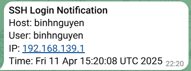

# GIÁM SÁT TRUY CẬP SSH VÀO HỆ THỐNG BẰNG TELEGRAM BOT
**Set up:**
- Máy chủ với IP Public có kết nối với internet.
- Đã có tài khoản telegram.
- Thao tác với user root.

# 1. Cài đặt jq
`jq` là ứng dụng để đọc thông tn file `Json` trên Linux Câu lệnh cài đặt.

Trên Ubuntu:
```
apt-get -y install jq
```
Trên CentOS7:
```
yum install epel-release -y
yum install jq -y
```
# 2. Tạo file script
Ta sẽ tạo file script tại thư mục `/etc/profile.d/`. Để khi đăng nhập vào hệ thống thì script sẽ thực hiện ngay lập tức.

Tạo file script ssh-telegram.sh:
```
touch ssh-telegram.sh
```

Nội dung script:
```
#!/usr/bin/env bash

#CHAT ID information
TELEGRAM_CHAT_ID="6314000780"
#BOT Token information
TELEGRAM_BOT_TOKEN="8072023596:AAFIJ9qTFt7yEjfnFTXknMM3Jye0NWemVRQ"

#Khai bao thong tin.
LOGGED_USER="$(whoami)"
LOGGED_HOST="$(hostname -f)"
LOGGED_IP="$(echo $SSH_CONNECTION | cut -d " " -f 1)"
NOW="$(date)"

#Noi dung gui den telegram
MESSAGE="$(echo -e "<strong>SSH Login Notification</strong>\nHost: $LOGGED_HOST\nUser: $LOGGED_USER\nIP: $LOGGED_IP\nTime: $NOW")"

#cau hinh khi goi den api cua telegram bot
/usr/bin/curl --silent --output /dev/null \
    --data-urlencode "chat_id=${TELEGRAM_CHAT_ID}" \
    --data-urlencode "text=${MESSAGE}" \
    --data-urlencode "parse_mode=HTML" \
    --data-urlencode "disable_web_page_preview=true" \
    "https://api.telegram.org/bot${TELEGRAM_BOT_TOKEN}/sendMessage?"
```

# 3. Kết quả
Sau khi ssh vào server ta sẽ nhận thông báo như sau:



Tài liệu tham khảo:

[1] (https://github.com/longbao87/linuxtips/blob/main/centos-notification-login)