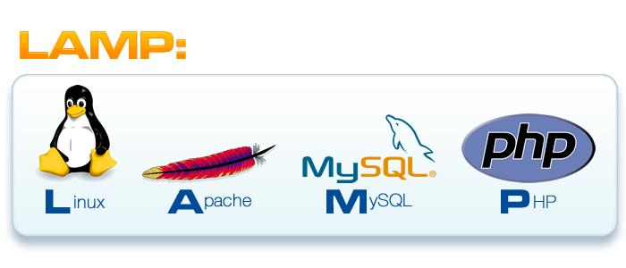

# TÌM HIỂU VỀ LAMP STACK VÀ LEMP STACK
# 1. LAMP stack là gì?
LAMP stack là một bộ công cụ mã nguồn mở được sử dụng để tạo và phát triển ứng dụng web. Để hoạt động tốt, bộ công cụ này cần có hệ điều hành, web server, database và ngôn ngữ lập trình.

Tên LAMP là từ viết tắt của các program sau:
- Hệ điều hành Linux.
- Apache HTTP Server.
- Hệ quản trị database MySQL.
- Ngôn ngữ lập trình PHP.

## 1.1 Linux
Trong LAMP Stack, Linux là phần mềm quan trọng nhất, giống như nền tảng cho các thành phần khác hoạt động. Các phiên bản Linux phổ biến dùng trong LAMP Stack gồm Ubuntu, CentOS, Debian và Red Hat Enterprise Linux.

Mặc dù các thành phần khác có thể chạy trên các hệ điều hành khác, nhưng Linux vẫn là lựa chọn hàng đầu cho phát triển web bởi tính linh hoạt, dễ tùy chỉnh và miễn phí bản quyền. Thêm vào đó, PHP và MySQL cũng hoạt động tốt hơn trên Linux so với Windows.

## 1.2 Apache
Apache HTTP Server Là một phần mềm máy chủ web phổ biến nhất hiện nay, chạy trên hệ điều hành Linux. Apache xử lý các yêu cầu từ người dùng trên internet. Ngoài ra, một lựa chọn thay thế khác là NGINX, cũng là một máy chủ web đang ngày càng phổ biến.

Apache thường được sử dụng cho các trang web chia sẻ hosting, trong khi NGINX phù hợp hơn với các máy chủ riêng lẻ hoặc các dịch vụ đám mây. Nên chọn Apache hay NGINX tùy thuộc vào loại nội dung bạn muốn hiển thị trên trang web.

## 1.3 MySQL
Trong LAMP Stack, MySQL được dùng để lưu trữ và tìm kiếm thông tin. Các dữ liệu như thông tin khách hàng, doanh số sẽ được lưu trữ trong MySQL. Khi cần tìm kiếm, máy tính sẽ hỏi thông tin từ MySQL bằng ngôn ngữ SQL.

MariaDB là một công cụ lưu trữ dữ liệu, có thể thay thế MySQL trong LAMP stack. Việc lựa chọn giữa MariaDB (mở nguồn) hoặc MySQL (của Oracle) tùy thuộc vào nhu cầu sử dụng của người dùng.

# 1.4 PHP
PHP là một loại ngôn ngữ máy tính dùng để tạo và giúp website hoạt động trơn tru. Khi bạn mở một trang web, máy tính sẽ sử dụng PHP để xử lý và hiển thị thông tin cho bạn. PHP thường được dùng để làm website vì dễ học và nhanh. Ngoài ra, PHP có thể kết hợp với HTML.

Ngoài PHP, còn có Perl và Python cũng được dùng để tạo website. Cả ba loại là những công cụ đơn giản, hữu ích để tạo môi trường có thể phát triển thành công các app.

# 2. LEMP stack là gì?
Các thành phần cấu thành LEMP stack cũng gần tương tự với LAMP, chỉ khác là Apache sẽ được thay thế bởi nginx. Nginx được đọc là "engine-x", giải thích cho chữ E trong "LEPM", nginx cũng là một ứng dụng HTTP proxy. 