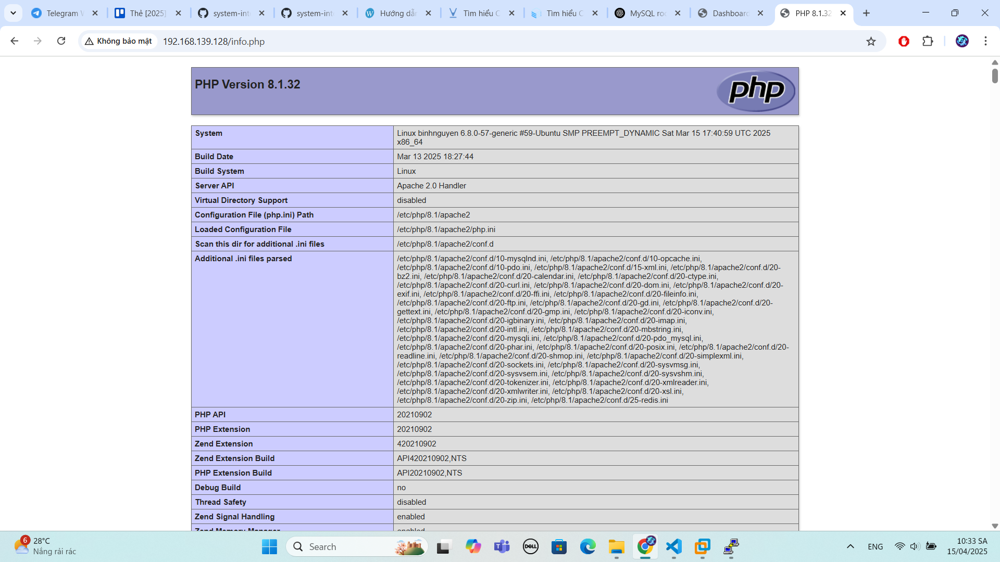
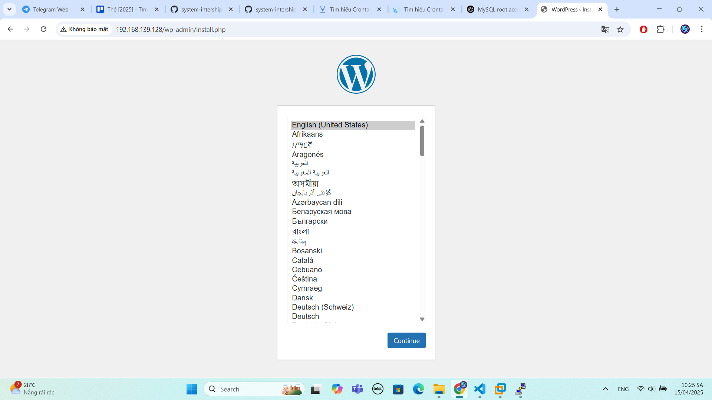

# Hướng dẫn cài đặt LAMP trên Ubuntu 24.04
# 1. Cài đặt webserver apache
- Để cài đặt, trên cửa sổ terminal gõ lệnh:
```
sudo apt -y install httpd
```
- Một số lệnh quản lý Apache:
```
systemctl start apache2      (Khởi động dịch vụ Apache)
systemctl stop apache2       (Dừng dịch vụ Apache)
systemctl reload apache2     (Tải lại dịch vụ Apache)
systemctl restart apache2   (Khởi động lại  dịch vụ Apache:)
systemctl enable apache2     (Thiết lập Apache khởi động cùng hệ thống)
systemctl disable apache2    (Vô hiệu hoá Apache khởi động cùng hệ thống )
systemctl status apache2     (Xem trạng thái dịch vụ Apache)
```
- Cài xong, tiến hành khởi động lại service:
```
systemctl start httpd
systemctl enable httpd
```
- Bạn có thể check lại trang thái hoạt động của service bằng cách gõ:
```
systemctl status httpd
```
- Bạn cũng có thể kiểm tra trạng thái trên trình duyệt bằng cách gõ trên thanh url địa chỉ sau:
```
192.168.139.132
```


# 2. Cài đặt hệ quản lí cơ sở dữ liệu( MySQL-MariaDB)
Trên thực tế với LAMP, bạn có thể sử dụng mysql hoặc mariadb đều được, bài này mình sẽ hướng dẫn với Mysql.

Trên cửa sổ terminal, tiến hành cài đặt mariadb:
```
wget http://repo.mysql.com/mysql-community-release-el7-5.noarch.rpm

rpm -ivh mysql-community-release-el7-5.noarch.rpm

yum install mysql-server
```
Tiến hành khởi động MySQL server:
```
systemctl start mysqld
```
Cài lại mật khẩu mật khẩu cho quyền root của cơ sở dữ liệu:
```
mysql_secure_installation
```
Lệnh này cho phép bạn cải thiện bảo mật cài đặt MariaDB theo các cách sau:
- Đặt mật khẩu cho tài khoản root .
- Xóa tài khoản root có thể truy cập từ bên ngoài localhost.
- Xóa tài khoản người dùng ẩn danh.
- Xóa cơ sở dữ liệu test (theo mặc định có thể được truy cập bởi tất cả người dùng, ngay cả người dùng ẩn danh) và các đặc quyền cho phép mọi người truy cập cơ sở dữ liệu có tên bắt đầu bằng test_.

**Tạo Database cho wordpress:**

Đăng nhập vào MySQL với user root:
```
mysql -u root -p
```
Tạo user và database để sử dụng cho wordpress:
```
create database tên-database;

create user 'user'@'IP' identified by 'pass';

GRANT ALL PRIVILEGES ON databases.* TO 'user'@'%';

flush privileges;
```


# 3. Cài đặt PHP
Thêm gói PPA (ondrej/php) để cài đặt PHP 8.1 và các modules cần thiết cho Apache:
```
sudo apt install software-properties-common
sudo add-apt-repository ppa:ondrej/php
sudo apt install -y php8.1 libapache2-mod-php8.1
sudo apt install php-net-ldap2 php-net-ldap3 php-imagick php8.1-common php8.1-gd php8.1-imap php8.1-mysql php8.1-curl php8.1-zip php8.1-xml php8.1-mbstring php8.1-bz2 php8.1-intl php8.1-gmp php8.1-redis
```
Kiểm tra phiên bản (version) của PHP:
```
php -v
```
Tiến hành kiểm tra kết quả. Ta thêm file sau:
```
echo "<?php phpinfo();?>" > /var/www/html/info.php
```
Sau đó restart lại apache:
```
systemctl restart apache2
```
Vào trình duyệt, gõ trên thanh url địa chỉ sau:
```
<địa chỉ ip>/info.php
```
Khi màn hình này xuất hiện, bạn đã thực hiện thành công!


# 4. Cài đặt wordpress
Cài đặt công cụ download wget:
```
yum install wget -y
```
Thay đổi thư mục hiện tại thành thư mục web:
```
cd /var/www/html
```
Tải xuống tệp WordPress mới nhất bằng cách chạy lệnh sau:
```
wget https://wordpress.org/latest.tar.gz
```
Giải nén tệp WordPress trong thư mục hiện tại:
```
tar xvzf latest.tar.gz
```
Di chuyển các tệp từ thư mục wordpress vào thư mục web:
```
mv /var/www/html/wordpress/* /var/www/html
```
Thay đổi tệp cấu hình WordPress bằng cơ sở dữ liệu đã tạo.
```
mv wp-config-sample.php wp-config.php
```
Mở tệp wp-config.php:Chỉnh sửa các thông số cấu hình
```
vi wp-config.php
```
Hoàn thành quá trình cài đặt, ta truy cập lại đường link : http://192.168.129.128:



Sau khi chọn ngôn ngữ ta chuyển sang giao diện cài đặt:


Hoàn thành thì sẽ chuyển đến phần đăng nhập.

Và đây là kết quả sau khi cài đặt:


Tài liệu tham khảo:

[1] (https://azdigi.com/blog/linux-server/webserver/cai-dat-lamp-stack-tren-ubuntu-22-04/)

[2] (https://github.com/ducthien1998/system-intership/blob/main/ThienBD/10.DNS/docs/05.Wordpress_1.md)
