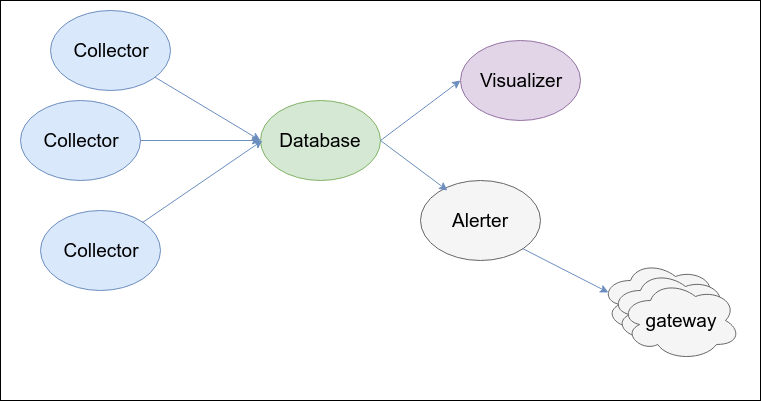
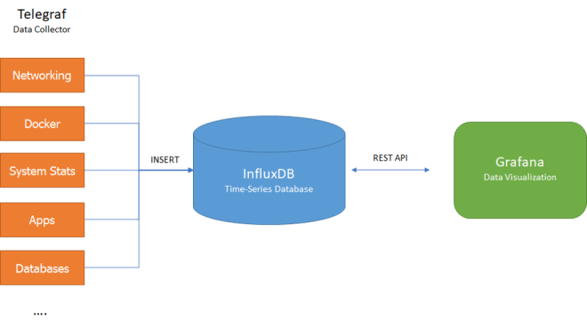

# TÌM HIỂU VỀ MONITORING 
# 1. Hệ thống giám sát Monitoring là gì?
Monitoring system là một hệ thống theo dõi, ghi lại các trạng thái, hoạt động của máy tính hay ứng dụng một cách liên tục.

Monitoring là hệ thống dùng để thu thập thông tin về phần cứng và phần mềm của một hệ thống IT. Hệ thống monitoring có thể thu thập từ trạng thái của của server (CPU, memory, network, …) cho đến những thông tin chi tiết về cách server xử lý request đến từ người dùng (số lượng requests/s, thời gian server xử lý requests, …).

# 2. Công dụng của Monitoring
- Dựa vào kết quả của hệ thống monitoring chúng ta có thể điêù chỉnh việc sử dụng tài nguyên (cpu, ram, disk, ...) sao cho phù hợp.
- Ngăn chặn các sự cố có thể xảy ra, nếu có xảy ra chúng ta cũng có thể phát hiện sớm hơn.
- Giảm thiểu thời gian quản lý hệ thống.
- Nắm bắt những gì đang diễn ra trên hệ thống của bạn.

# 3. Thành phần của một hệ thống Monitoring
Thông thường một hệ thống monitoring thường có 4 thành phần chính:

**Collector:** Được cài trên các máy agent (các máy muốn monitor), có nhiệm vụ collect metrics của host và gửi về database. Ví dụ: Cadvisor, Telegraf, Beat,...

**Database:** Lưu trữ các metrics mà colletor thu thập được, thường thì chúng ta sẽ sử dụng các time series database. Ví dụ ElasticSearch, InfluxDB, Prometheus, Graphite (Whisper)

**Visualizer:** Có nhiệm vụ trực quan hóa các metrics thu thập được qua các biểu đồ, bảng, .... Ví dụ: Kibana, Grafana, Chronograf

**Alerter:** Gửi thống báo đến cho sysadmin khi có sự cố xảy ra.

# 4. Một số stack phổ biến về Monitoring
Có rất nhiều stack phổ biến như:
- Logstash - Elasticsearch - Kibana
- Prometheus - Node Exporter - Grafana
- Telegraf - InfluxDB - Grafana

Tài liệu tham khảo:

[1] (https://devopsz.com/monitoring-system-part-1/)

[2] (https://devopsedu.vn/bai-1-buc-tranh-toan-canh-ve-monitoring-system/)