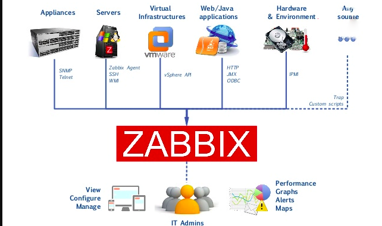
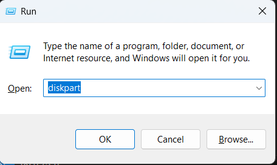

# TÌM HIỂU HỆ THỐNG GIÁM SÁT MẠNG ZABBIX
# 1. Tổng quan về Zabbix
## 1.1 Khái niệm
Zabbix là một hệ thống giám sát mạnh mẽ và linh hoạt được xây dựng dựa trên kiến trúc client-server. Nó cho phép bạn theo dõi, phân tích và hiển thị các thông số hoạt động của các thiết bị, máy chủ và ứng dụng trong mạng của bạn.

Zabbix sử dụng các đại diện (agents) để thu thập dữ liệu từ các thiết bị mục tiêu và truyền dữ liệu này về máy chủ Zabbix để xử lý và lưu trữ.

## 1.2 Lý do nên sử dụng Zabbix
- **Giảm thời gian chết hệ thống:** Zabbix giúp phát hiện sự cố kịp thời và cung cấp cảnh báo nhanh chóng, giúp giảm thiểu thời gian hệ thống không hoạt động.
- **Tăng hiệu suất hệ thống:** Bằng cách theo dõi hiệu suất của hệ thống, Zabbix cho phép bạn phát hiện và khắc phục các vấn đề về tài nguyên sớm, giúp tối ưu hóa hiệu suất.
- **Dễ dàng mở rộng:** Zabbix có khả năng mở rộng để giám sát mạng và hệ thống lớn với hàng nghìn thiết bị và máy chủ.
- **Giám sát tập trung:** Zabbix cung cấp một giao diện trực quan và tập trung để quản lý và giám sát tất cả các thành phần hệ thống từ một nơi duy nhất.
- **Báo cáo và phân tích:** Zabbix cung cấp các báo cáo chi tiết và công cụ phân tích để hiểu rõ hơn về hoạt động của hệ thống và đưa ra quyết định dựa trên dữ liệu.
## 1.3 Tính năng của Zabbix
- **Giám sát đa nền tảng:** Zabbix hỗ trợ giám sát trên nhiều hệ điều hành như Linux, Windows, Unix và nhiều thiết bị mạng khác nhau.
- **Giám sát mạng:** Zabbix cho phép bạn theo dõi các thành phần mạng như router, switch, cổng và giao thức mạng.
- **Giám sát máy chủ:** Bằng cách cài đặt đại diện trên máy chủ, Zabbix giám sát các thông số như tài nguyên CPU, bộ nhớ, ổ đĩa và dịch vụ chạy trên máy chủ.
- **Giám sát ứng dụng:** Zabbix có thể giám sát các ứng dụng web, cơ sở dữ liệu, dịch vụ mạng và ứng dụng do người dùng tạo ra.
- **Cảnh báo và thông báo:** Zabbix cung cấp cơ chế cảnh báo linh hoạt để thông báo về sự cố và sự thay đổi của hệ thống qua email, SMS hoặc các kênh thông báo khác.
- **Báo cáo và phân tích:** Zabbix cung cấp báo cáo chi tiết và các công cụ phân tích để hiểu rõ hơn về hiệu suất và hoạt động của hệ thống.
## 1.4 Cấu trúc của Zabbix

- **Zabbix Server:** Đây là ứng dụng chương trình dịch vụ chính của dịch vụ Zabbix. Zabbix Server sẽ chịu trách nhiệm cho các hoạt động kiểm tra dịch vụ mạng từ xa, thu thập thông tin, lưu trữ, hiển thị, cảnh báo,… từ đó các quản trị viên có thể thao tác giám sát hệ thống tốt nhất.
- **Zabbix Proxy:** là một máy chủ được dùng cho việc quản lý nhiều nhánh hệ thống ở xa, hoặc ở các lớp mạng khác nhau. Từ Zabbix Proxy sẽ thu thập các thông tin thiết bị mạng rồi chuyển tiếp về cho máy chủ dịch vụ chính Zabbix Server.
- **Zabbix Agent:** để giám sát chủ động các thiết bị cục bộ và các ứng dụng (ổ cứng, bộ nhớ, …) trên hệ thống mạng. Zabbix Agent sẽ được cài lên trên Server và từ đó Agent sẽ thu thập thông tin hoạt động từ Server mà nó đang chạy và báo cáo dữ liệu này đến Zabbix Server để xử lý.
- **Giao diện web:** cung cấp giao diện web trên nền tảng mã nguồn PHP cùng phong cách metro tinh tế. Hiện tại có thể xem Zabbix là một trong những ứng dụng có giao diện đẹp nhất, thiết kế vị trí tính năng bắt mắt và hợp lý.
# 2. Cơ chế hoạt động
Zabbix hoạt động dựa trên kiến trúc client-server. Đầu tiên, người dùng cài đặt Zabbix Server, đóng vai trò là trung tâm quản lý và lưu trữ dữ liệu giám sát. Sau đó, các Zabbix Agent được cài đặt trên các máy chủ hoặc thiết bị cần giám sát. Agent sẽ thu thập thông tin và gửi nó đến Zabbix Server.

Zabbix server thu thập thông tin từ Agent thông qua các item tương ướng. Các item có nhiều loại, tuy nhiên 2 loại chính là `Active Item (Item chủ động)` và `Passive Item (Item bị động)`.

Tài liệu tham khảo:

[1] (https://bkhost.vn/blog/zabbix-la-gi/#:~:text=Zabbix%20ho%E1%BA%A1t%20%C4%91%E1%BB%99ng%20d%E1%BB%B1a%20tr%C3%AAn,g%E1%BB%ADi%20n%C3%B3%20%C4%91%E1%BA%BFn%20Zabbix%20Server.)
