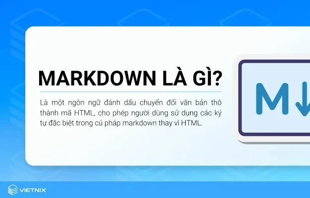

# MARKDOWN
## 1. Markdown là gì?
Markdown là **một ngôn ngữ đánh dấu nhẹ (lightweight markup language)**, được thiết kế để viết và định dạng văn bản một cách đơn giản, dễ đọc, và dễ chuyển đổi sang HTML hoặc các định dạng khác.

Markdown hiện nay được sử dụng rộng rãi trong:
- Viết tài liệu kỹ thuật.
- Soạn thảo README cho dự án trên GitHub/GitLab.
- Viết blog, ghi chú, tài liệu học tập.
- Hệ thống quản lý nội dung (CMS), diễn đàn, wiki.
## 2. Ưu điểm của Markdown
- **Dễ học, dễ viết**: cú pháp đơn giản, gần giống viết văn bản thường.
- **Tương thích cao**: có thể chuyển đổi sang HTML, PDF, DOCX, LaTeX…
- **Đa nền tảng**: hỗ trợ trên nhiều IDE, trình soạn thảo, website.
- **Nhẹ và sạch**: không cần phần mềm nặng, chỉ cần text editor là viết được.
## 3. Cú pháp đơn giản trong Markdown
### 3.1. Tiêu đề (heading)
Dùng dấu `#` ở đầu dòng

Cú pháp
```
# Heading 1
## Heading 2
### Heading 3
```
Kết quả
# Heading 1
## Heading 2
### Heading 3
### 3.2. Định dạng chữ
Cú pháp
```
**In đậm**: `Text`→**Text**
*In nghiêng*: `Text`→*Text*
~~Gạch ngang~~: `Text`→~~Text~~
```
Kết quả
- **In đậm**: `Text`→**Text**
- *In nghiêng*: `Text`→*Text*
- ~~Gạch ngang~~: `Text`→~~Text~~
### 3.3. Danh sách
- **Danh sách không thứ tự**

Cú pháp
```
- Item 1
- Item 2
 - Sub Item
```
Kết quả

- Item 1

- Item 2

  - Item 1
  - Item 2
- **Danh sách có thứ tự**

Cú pháp
```
1. Part 1
2. Part 2
3. Part 3

```
Kết quả

1. Part 1

2. Part 2

3. Part 3
### 3.4. Liên kết và hình ảnh
- Liên kết

Cú pháp
```
[Tìm hiểu về Markdown](https://vietnix.vn/markdown-la-gi/?gad_source=1&gad_campaignid=21448222547&gbraid=0AAAAABwedNLJ14dwmYvymkIQgePYL15oo&gclid=Cj0KCQjwoP_FBhDFARIsANPG24PwRrSOXBdxQgpNaLrKobJc3HetS2MOMQpGaMXT2Lflkmd0aAikAjwaAsL8EALw_wcB)
```
Kết quả

[Tìm hiểu về Markdown](https://vietnix.vn/markdown-la-gi/?gad_source=1&gad_campaignid=21448222547&gbraid=0AAAAABwedNLJ14dwmYvymkIQgePYL15oo&gclid=Cj0KCQjwoP_FBhDFARIsANPG24PwRrSOXBdxQgpNaLrKobJc3HetS2MOMQpGaMXT2Lflkmd0aAikAjwaAsL8EALw_wcB)
- Hình ảnh

Cú pháp
```

```
Kết quả


### 3.5. Trích dẫn và code
- Trích dẫn

Cú pháp
```
> Đây là một đoạn trích dẫn
```
Kết quả
> Đây là một đoạn trích dẫn
- Code inline

Cú pháp
```
`code`
```
Kết quả

`code`
- Code block

```python
print("hello Markdorn")
```
### 3.6. Bảng
Cú pháp

```
| Cột 1| Cột 2| Cột 3|
| ----| ----| ----|
| 1 | 2 | 3 |
| 4 | 5 | 6 |
```
Kết quả

| Cột 1| Cột 2| Cột 3|
|----| ----| ----|
| 1 | 2 | 3 |
| 4 | 5 | 6 |
### 3.7. Đường kẻ ngang
Cú pháp

```
---
```
Kết quả

---
### 3.8. Checklist
Cú pháp

```
- [x] Việc đã làm
- [ ] Việc chưa làm
```
Kết quả

- [x] Việc đã làm
- [ ] Việc chưa làm
### 3.9. Ký tự đặc biệt
Dùng `\` để thoát ký tự đặc biệt
Cú pháp

```
\*Không in nghiêng\*
```
Kết quả

\*Không in nghiêng\*
## Ứng dụng thực tế
- **Blog cá nhân**: Viết nhanh, xuất bản đẹp.
- **Ghi chú học tập**: Kết hợp với Obsidian, Notion, Jupyter Notebook.
- **Tài liệu kỹ thuật**: Viết hướng dẫn, API docs.
## Kết luận
Markdown là một công cụ mạnh mẽ, đơn giản nhưng hiệu quả, giúp việc viết tài liệu trở nên dễ dàng, gọn nhẹ và phổ biến rộng rãi trong cộng đồng lập trình, nghiên cứu và viết nội dung.