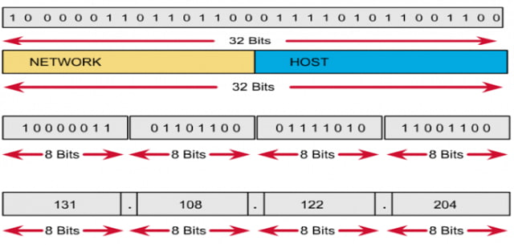
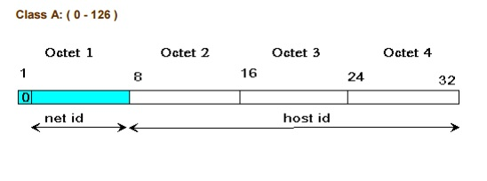
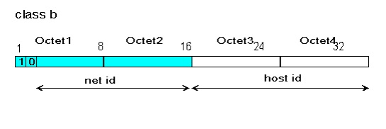
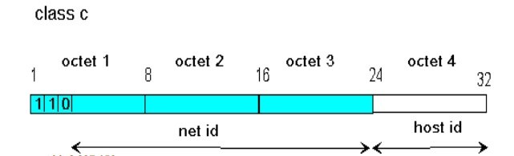

# Tìm hiểu về IPv4
## I. IPv4 là gì?
**IPv4 (Internet Protocol version 4)** là giao thức Internet phiên bản 4. Đây là giao thức mạng phổ biến nhất hiện nay.

Nó dùng **địa chỉ IP dài 32-bit**, được biểu diễn dưới dạng chuỗi số và chia thành các nhóm được ngăn cách bằng dấu chấm. `Ví dụ: 192.168.0.1`
## II. Tại sao lại không có IPv1,v2,v3,v5
### 1. IPv1
Xuất hiện cuối thập niên 1970 trong các bản phác thảo ban đầu của giao thức Internet Protocol.

Chỉ là bản thử nghiệm trong phòng lab ARPANET.Không được công bố thành RFC chính thức → `không có triển khai thật sự`.
### 2. IPv2
Là phiên bản sửa lỗi và cái tiến của IPv1, Vẫn chỉ tồn tại trong nội bộ nghiên cứu → `Chưa bao giờ trở thành chuẩn chính thức, bị thay thế nhanh chóng bởi phiên bản kế tiếp`.
### 3. IPv3
Là bản thử nghiệm, chủ yếu để kiểm tra việc đánh số phiên bản → `Không có triển khai thực tế, không công bố rộng rãi`.
### 4. IPv5
IPv5 Là giao thức thử nghiệm có tên gọi Internet Stream Protocol (ST), dùng để hỗ trợ truyền **âm thanh, video theo luồng (streaming)**
- Sử dụng cùng cấu trúc đánh số phiên bản `5`.
- Là giao thức thử nghiệm, không tương thích với IPv4.

→ Không bao giờ trở thành chuẩn IP chính thức.

> Tóm lại: Tất cả các giao thức là phiên bản thử nghiệm không bao giờ triển khai
## III. Cấu trúc của IPv4
Về cấu tạo, địa chỉ IPv4 sẽ có 32 bit và được biểu diễn thành một dãy số nhị phân và chia thành 4 cụm. Mỗi cụm như vậy sẽ gọi là octet. Mỗi octet sẽ là 8 bit và chúng được ngăn cách bằng dấu chấm `.`

## IV. Các thành phần của IPv4
### 1. Địa chỉ IPv4(IP Address)
- Độ dài **32 bit** → biểu diễn bằng 4 số thập phân (0–255), ngăn cách bằng dấu chấm.
Ví dụ: 192.168.1.10
 - **Chức năng**: định danh thiết bị trong mạng, giống như “số nhà” để gửi dữ liệu đúng nơi.
### Phân loại địa chỉ
- **Public**: địa chỉ duy nhất trên Internet.

- **Private**: dùng trong LAN (10.x.x.x, 172.16.x.x–172.31.x.x, 192.168.x.x).

- **Loopback**: 127.0.0.1 (localhost).

- **Broadcast**: gửi cho tất cả host trong mạng (VD: 192.168.1.255).

- **Multicast**: gửi cho một nhóm host.
### 2. Subnet Mask
- Cũng là số 32 bit, đi kèm địa chỉ IPv4.

- Dùng để chia địa chỉ IP thành **phần mạng (Network) và phần host (Host).**
Ví dụ:

- IP: `192.168.1.10`

- Subnet mask: `255.255.255.0`
→ Network = `192.168.1.0/24`, Host có thể từ `192.168.1.1` → `192.168.1.254`.
### 3. Gói tin IPv4 (IPv4 Packet)
#### 3.1. Header (tiêu đề – tối thiểu 20 byte)
Chứa các thông tin điều khiển:
- **Version**: phiên bản (IPv4 = 4).
- **Header Length (IHL)**: độ dài header.
- **Type of Service (DSCP/ToS)**: ưu tiên dịch vụ (QoS).
- **Total Length**: tổng độ dài gói tin.
- **Identification, Flags, Fragment Offset**: hỗ trợ phân mảnh gói tin.
- **TTL (Time to Live)**: giới hạn số hop (router).
- **Protocol**: giao thức lớp trên (TCP=6, UDP=17, ICMP=1...).
- **Header Checksum**: kiểm tra lỗi header.
- **Source Address**: địa chỉ IP nguồn.
- **Destination Address**: địa chỉ IP đích.
#### 3.2. Payload (dữ liệu)
- Chứa dữ liệu của giao thức lớp trên (TCP segment, UDP datagram, ICMP, OSPF...).
- Kích thước tối đa: **65.535 byte** (tính cả header).
## V. Các lớp của IPv4
Dựa vào cách chọn địa chỉ mạng mà địa chỉ IP được phân thành 5 lớp A, B, C, D, E. Đặc điểm của các lớp như sau:
## Lớp A

Địa chỉ lớp A có phần mạng là 8 bit đầu và phần host là 24 bit sau. Bit đầu tiên của phần mạng luôn là 0.

Lớp A sẽ có các địa chỉ mạng từ `1.0.0.0`đến `126.0.0.0` và mỗi mạng sẽ có 224 địa chỉ host (loại trừ địa chỉ mạng và địa chỉ broadcast).

Mạng loopback sẽ là `127.0.0.0`.
## Lớp B

Địa chỉ lớp B có phần mạng là 16 bit đầu và phần host là 16 bit sau. 2 bit đầu tiên của phần mạng luôn là 1.0.

Lớp B sẽ có các địa chỉ mạng từ `128.0.0.0` đến `191.255.0.0` và mỗi mạng sẽ có 214 địa chỉ host (loại trừ địa chỉ mạng và địa chỉ broadcast).
## Lớp C

Địa chỉ lớp C có phần mạng là 24 bit đầu và phần host là 8 bit sau. 3 bit đầu tiên của phần mạng luôn là `1.1.0`.

Lớp C sẽ có các địa chỉ mạng từ `192.0.0.0` đến `223.255.255.0` và mỗi mạng sẽ có 26 địa chỉ host (loại trừ địa chỉ mạng và địa chỉ broadcast).
## Lớp D
Các địa chỉ trong lớp D là những địa chỉ multicast bao gồm `224.0.0.0` đến `239.255.255.255`.
## Lớp E
Các địa chỉ trong lớp E có vai trò dùng để dự phòng, bao gồm những địa chỉ từ `240.0.0.0` trở đi.
## chú ý
Các host chỉ có thể sử dụng địa chỉ IP trong 3 lớp A, B, C. Để biết địa chỉ nằm trong lớp nào, ta sẽ xem số đầu tiên trong địa chỉ IP để biết dựa vào các khoảng sau:

Lớp A từ `1` đến `126`.

Lớp B từ `128` đến `191`.

Lớp C từ `192` đến `223`.

Lớp D từ `224` đến `239`.

Lớp E từ `240` đến `255`.
## VI. Phân biệt IP Public và IP Private
### 1. IP Public
IP Public `(hay địa chỉ IP công cộng)` là **địa chỉ IP duy nhất được nhà cung cấp dịch vụ Internet (ISP) gán cho thiết bị của bạn, cho phép thiết bị đó kết nối trực tiếp với Internet toàn cầu và giao tiếp với các máy chủ khác trên thế giới**. Địa chỉ IP Public đóng vai trò như "địa chỉ nhà" của thiết bị trên mạng Internet, giúp các thiết bị khác xác định và kết nối với nó. 
### 2. IP Private

IP Private `(hay còn gọi là địa chỉ IP riêng)` là địa chỉ IP được sử dụng chỉ trong phạm vi một mạng nội bộ (LAN) như gia đình, văn phòng, hoặc trường học, giúp các thiết bị trong cùng mạng đó giao tiếp với nhau.

**Dải địa chỉ IP Private**

Tổ chức IANA (Internet Assigned Numbers Authority) đã quy định các dải IP Private, bao gồm:
- 10.0.0.0 – 10.255.255.255 (10.0.0.0/8)
- 172.16.0.0 – 172.31.255.255 (172.16.0.0/12)
- 192.168.0.0 – 192.168.255.255 (192.168.0.0/16) 
## 3. Sự khác biệt giữa IP Public và IP Private
Sự khác biệt chính giữa địa chỉ IP công cộng và riêng tư là IP công cộng có thể được nhìn thấy bởi các thiết bị Internet khác, trong khi IP riêng tư thì không. Do đó, địa chỉ IP công cộng được sử dụng để tương tác và liên lạc trực tuyến, trong khi địa chỉ IP riêng hoạt động trong mạng cục bộ.

|Loại|Địa chỉ IP Public|Địa chỉ IP Private|
|-------------|--------------------------------|-----------------------------------------|
|Phạm vi|Toàn cầu|Cục bộ|
|Liên lạc|Giao tiếp qua mạng|Giao tiếp mạng riêng|
|Nguồn gốc|Được chỉ định bởi ISP|Được chỉ định bởi ISP|
|Phạm vi dải IP|Bất kỳ IP nào không nằm trong dải địa chỉ IP riêng|Bất kỳ địa chỉ nào trong các phạm vi sau: -10.0.0.0 – 10.255.255.255  -172.16.0.0 – 172.31.255.255 -192.168.0.0 – 192.168.255.255|
|Bảo mật|IP công cộng yêu cầu các biện pháp bảo mật bổ sung vì chúng dễ bị tấn công.|IP riêng được bảo mật.|
## VII. Cách chia địa chỉ IPv4
**Địa chỉ IPv4** = 32 bit → chia thành 2 phần:
- **Network**: định danh mạng.
- **Host**:định danh máy trong mạng.

**Subnet mask** cho biết bao nhiêu bit dành cho network.
- Ví dụ: /24 = 255.255.255.0 = 24 bit cho Network, 8 bit cho Host.
### Công thức tính toán
- **Số subnet** = 2^s (s = số bit mượn thêm từ phần host để chia mạng).

- **Số host khả dụng mỗi subnet++ = 2^h – 2 (h = số bit còn lại cho host; trừ 2 vì có Network + Broadcast).

**Ví dụ minh hoạ**:Chia nhỏ `192.168.1.0/24` thành 4 subnet

- Muốn có 4 subnet → cần 2^s ≥ 4 → mượn 2 bit từ phần host.
- /24 + 2 = /26 → Subnet mask = 255.255.255.192.
- Mỗi subnet có: 2^6 – 2 = 62 host khả dụng.

Các subnet:
1. 192.168.1.0/26 → Host: 192.168.1.1 – 192.168.1.62 → Broadcast: 192.168.1.63
2. 192.168.1.64/26 → Host: 192.168.1.65 – 192.168.1.126 → Broadcast: 192.168.1.127
3. 192.168.1.128/26 → Host: 192.168.1.129 – 192.168.1.190 → Broadcast: 192.168.1.191
4. 192.168.1.192/26 → Host: 192.168.1.193 – 192.168.1.254 → Broadcast: 192.168.1.255

## VIII. Phân biệt multicast và broadcast

