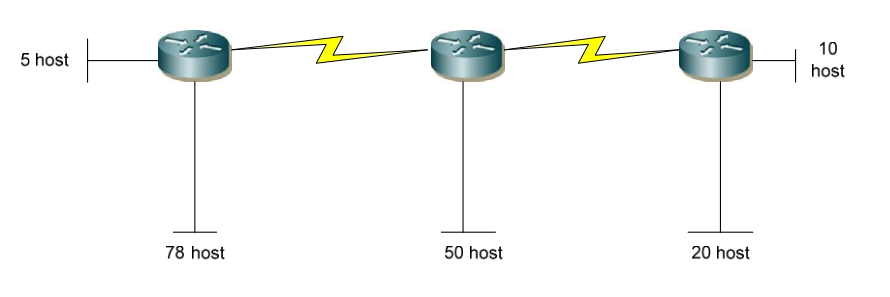

# Tìm hiểu về IPv4
## I. IPv4 là gì?
**IPv4 (Internet Protocol version 4)** là giao thức Internet phiên bản 4. Đây là giao thức mạng phổ biến nhất hiện nay.

Nó dùng **địa chỉ IP dài 32-bit**, được biểu diễn dưới dạng chuỗi số và chia thành các nhóm được ngăn cách bằng dấu chấm. `Ví dụ: 192.168.0.1`
## II. Tại sao lại không có IPv1,v2,v3,v5
### 1. IPv1
Xuất hiện cuối thập niên 1970 trong các bản phác thảo ban đầu của giao thức Internet Protocol.

Chỉ là bản thử nghiệm trong phòng lab ARPANET.Không được công bố thành RFC chính thức → `không có triển khai thật sự`.
### 2. IPv2
Là phiên bản sửa lỗi và cái tiến của IPv1, Vẫn chỉ tồn tại trong nội bộ nghiên cứu → `Chưa bao giờ trở thành chuẩn chính thức, bị thay thế nhanh chóng bởi phiên bản kế tiếp`.
### 3. IPv3
Là bản thử nghiệm, chủ yếu để kiểm tra việc đánh số phiên bản → `Không có triển khai thực tế, không công bố rộng rãi`.
### 4. IPv5
IPv5 Là giao thức thử nghiệm có tên gọi Internet Stream Protocol (ST), dùng để hỗ trợ truyền **âm thanh, video theo luồng (streaming)**
- Sử dụng cùng cấu trúc đánh số phiên bản `5`.
- Là giao thức thử nghiệm, không tương thích với IPv4.

→ Không bao giờ trở thành chuẩn IP chính thức.

> Tóm lại: Tất cả các giao thức là phiên bản thử nghiệm không bao giờ triển khai
## III. Cấu trúc của IPv4
Về cấu tạo, địa chỉ IPv4 sẽ có 32 bit và được biểu diễn thành một dãy số nhị phân và chia thành 4 cụm. Mỗi cụm như vậy sẽ gọi là octet. Mỗi octet sẽ là 8 bit và chúng được ngăn cách bằng dấu chấm `.`

## IV. Các thành phần của IPv4
