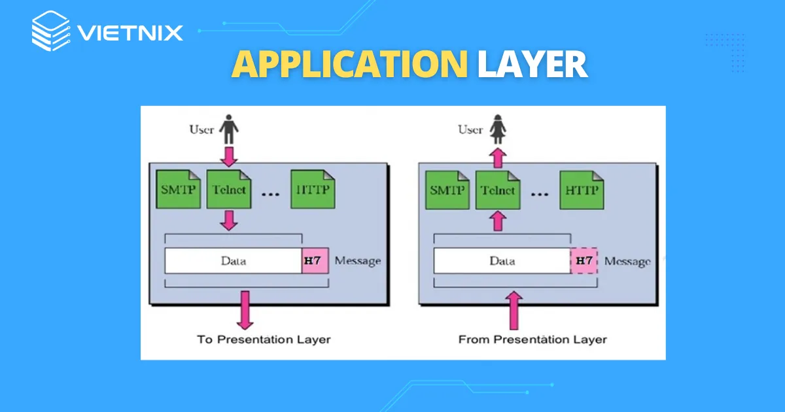

# Mô hình OSI
## MÔ HÌNH OSI LÀ GÌ ?

Mô hình OSI **(Open Systems Interconnection)** là một mô hình tham chiếu 7 tầng do Tổ chức Tiêu chuẩn Hóa Quốc tế (ISO) phát triển nhằm cung cấp một khung chuẩn để các hệ thống mạng đa dạng có thể giao tiếp với nhau.

**Mục đích của mô hình OSI**

**Chuẩn hóa**: Tạo ra một chuẩn chung cho truyền thông mạng, giúp các thiết bị và phần mềm từ các nhà cung cấp khác nhau tương thích với nhau.

**Trừu tượng hóa**: Chia quá trình truyền thông phức tạp thành các tầng nhỏ hơn, mỗi tầng có chức năng riêng biệt và các giao thức riêng. 

**Giao tiếp**: Cung cấp một "ngôn ngữ chung" cho các hệ thống máy tính để giao tiếp hiệu quả qua mạng. 
## Các tầng trong mô hình OSI
**Layer 1 – Physical Layer (Lớp vật lý)**
1. **Khái niệm**: Lớp vật lý phương tiện truyền dẫn vật lý và các công nghệ để truyền dữ liệu qua phương tiện đó. Về cốt lõi, hoạt động truyền dữ liệu là việc truyền tín hiệu kỹ thuật số và điện tử thông qua các kênh vật lý khác nhau như cáp quang, cáp đồng và không khí.
2. **Đặc điểm**: chịu trách nhiệm truyền các bit dữ liệu thô qua môi trường vật lý như cáp hoặc sóng vô tuyến.
3. **Chức năng**: 
- Chuyển đổi dữ liệu ở dạng bit thành tín hiệu vật lý để truyền qua môi trường truyền dẫn và ngược lại. 
- Tạo ra kết nối vật lý có dây hoặc không dây giữa các thiết bị mạng. 
- Xác định các đặc điểm về điện, cơ học và quang học cho kết nối, như mức điện áp, tần số, và các thông số kỹ thuật của cáp.

**Layer 2 – Data Link Layer (Lớp liên kết dữ liệu)**
1. **Khái niệm**: Lớp liên kết dữ liệu là các công nghệ được sử dụng để kết nối hai máy trên một mạng nơi lớp vật lý đã tồn tại. Lớp này quản lý khung dữ liệu – là các tín hiệu kỹ thuật số được gói gọn trong các gói dữ liệu. Kiểm soát lưu lượng và kiểm soát lỗi dữ liệu thường là trọng tâm chính của lớp liên kết dữ liệu.
2. **Đặc điểm**: đóng khung dữ liệu, định địa chỉ MAC, kiểm soát lỗi, kiểm soát luồng và kiểm soát truy cập phương tiện.
3. **Chức năng**: 
- Chia nhỏ dữ liệu từ lớp mạng thành các khung có cấu trúc, bao gồm thông tin địa chỉ MAC nguồn và đích, và các bit để kiểm soát lỗi.
- Phát hiện và có thể sửa các lỗi bit xảy ra trong quá trình truyền dữ liệu ở Lớp Vật lý, đảm bảo dữ liệu được truyền đi chính xác.

**Layer 3 - Network Layer (Lớp mạng)**
1. **Khái niệm**: chịu trách nhiệm định tuyến và chuyển tiếp gói dữ liệu qua nhiều mạng khác nhau bằng cách sử dụng địa chỉ IP, đảm bảo dữ liệu đến được đích.
2. **Đặc điểm**: Xác định đường đi tối ưu, sử dụng giao thức IP để đánh địa chỉ logic, xử lý lỗi và tắc nghẽn mạng, chia dữ liệu thành các gói và lắp ráp lại tại đích.
3. **Chức năng**:
- **Định tuyến (routing)**: Xác định đường đi tối ưu cho gói tin từ nguồn đến đích.
- **Địa chỉ logic (Logical Addressing)**: Sử dụng địa chỉ IP thay cho địa chỉ vật lý.
- **Chuyển tiếp gói tin (Packet Forwarding)**: Sau khi xác định được đường đi, lớp này sẽ chuyển tiếp các gói tin dữ liệu theo đường đi đã chọn.

**Layer 4 – Transport Layer (Lớp vận chuyển)**
1. **Khái niệm**: chịu trách nhiệm quản lý việc truyền dữ liệu từ đầu cuối đến đầu cuối (end-to-end) một cách đáng tin cậy.
2. **Đặc điểm**: chia nhỏ dữ liệu lớn thành các phân đoạn nhỏ hơn, đảm bảo các phân đoạn đến đúng trình tự, kiểm soát luồng dữ liệu để tránh quá tải thiết bị nhận, và phục hồi lỗi để dữ liệu được truyền đi đầy đủ.
3. **Chức năng**:
- **Truyền dữ liệu End-to-End**: Khác với các tầng dưới chỉ truyền dữ liệu giữa các tầng kề nhau, lớp truyền tải đảm bảo dữ liệu đi từ ứng dụng trên máy gửi đến ứng dụng trên máy nhận.
- **Phân đoạn và Lắp ráp (Segmentation and Reassembly)**: Lớp này chia các gói dữ liệu lớn từ lớp trên thành các phân đoạn (segments) nhỏ hơn để truyền qua mạng và lắp ráp lại chúng theo đúng thứ tự ở phía nhận.
- **Kiểm soát luồng (Flow Control)**: Điều chỉnh tốc độ truyền dữ liệu để ngăn chặn tình trạng thiết bị gửi quá nhanh làm quá tải thiết bị nhận, đảm bảo kết nối ổn định.
- **Kiểm soát lỗi (Error Control)**: Phát hiện các phân đoạn dữ liệu bị lỗi hoặc mất và yêu cầu truyền lại, đảm bảo dữ liệu đến đích đầy đủ và chính xác.

**Layer 5 – Session Layer (Lớp phiên)**
1. **Khái niệm**: Lớp phiên trong mô hình OSI chịu trách nhiệm quản lý các phiên giao tiếp (hay các cuộc hội thoại) giữa các ứng dụng, bao gồm thiết lập, duy trì và chấm dứt kết nối.
2. **Đặc điểm**: **kiểm soát hội thoại** (xác định ai gửi dữ liệu và khi nào) và **đồng bộ hóa** (chèn các điểm kiểm tra để phục hồi phiên khi bị gián đoạn).
3. **Chức năng**:
- **Thiết lập, duy trì và chấm dứt phiên (Establish, maintain, and terminate sessions)**:Lớp phiên tạo ra một "phiên" (kết nối) giữa các ứng dụng ở hai đầu, đảm bảo phiên tồn tại đủ lâu để truyền dữ liệu và sau đó chấm dứt một cách có trật tự. 
- **Kiểm soát hội thoại (Dialog Control)**:
Lớp này điều khiển luồng giao tiếp, quyết định xem hai ứng dụng có thể gửi dữ liệu song song (full-duplex), luân phiên (half-duplex) hay chỉ một chiều (simplex).
- **Đồng bộ hóa và phục hồi (Synchronization and Recovery)**:Lớp phiên đánh dấu các điểm kiểm tra (checkpoints) trong luồng dữ liệu. Nếu phiên bị ngắt quãng, nó có thể khôi phục và tiếp tục từ điểm kiểm tra gần nhất, thay vì phải bắt đầu lại hoàn toàn.

**Layer 6 – Presentation Layer (Lớp trình bày)**
1. **Khái niệm**: Là tầng **“phiên dịch”** dữ liệu giữa tầng Ứng dụng (Application Layer) và tầng Giao vận (Transport Layer). Nó không quan tâm đến dữ liệu là gì, chỉ đảm bảo dữ liệu được chuyển đổi về định dạng mà cả hai hệ thống (nguồn – đích) đều hiểu được.
2. **Đặc điểm**: chuyển đổi dữ liệu, mã hóa và giải mã, và nén dữ liệu.
3. **Chức năng**: 
- **Định dạng dữ liệu**: Chuyển đổi dữ liệu từ định dạng của ứng dụng sang định dạng tiêu chuẩn để truyền đi. Khi đến bên nhận, dữ liệu được chuyển ngược lại thành định dạng mà ứng dụng hiểu.
- **Mã hóa và giải mã (Encryption/Decryption)**: bảo mật dữ liệu khi truyền qua mạng.
- **Nén và giải nén (Compression/Decompression)**: Giảm dung lượng dữ liệu trước khi truyền đi để tiết kiệm băng thông.

 **Layer 7 – Application Layer ( Lớp ứng dụng)**
 1. **Khái niệm**: là lớp trên cùng, cung cấp giao diện cho người dùng cuối truy cập và sử dụng dịch vụ mạng, chịu trách nhiệm về các giao thức như HTTP (duyệt web), FTP (truyền file) và SMTP (gửi email).
 2. **Đặc điểm**: xác định giao diện và dịch vụ mạng mà ứng dụng người dùng cuối sử dụng, quản lý các giao thức ứng dụng cụ thể, xác định tính khả dụng của tài nguyên mạng, và cung cấp dịch vụ thư, truy cập tệp từ xa, chia sẻ tài nguyên.
 3. **Chức năng**:
 - Giao diện trực tiếp với người dùng.
 - Cung cấp dịch vụ mạng: email, web, chat, file transfer.
 
 ## Workflow với mô hình OSI
 *Máy gửi*:
 - **Lớp ứng dụng**: Nhập thông tin người dùng vào máy(hình ảnh, văn bản,...)
 - **Lớp trình bày**: Chuyển dữ liệu thành một dạng chung để mã hóa dữ liệu
 - **Lớp phiên**: Thiết lập, quản lý và đồng bộ phiên giao tiếp
 - **Lớp vận chuyển**: Chia dữ liệu thành các degment nhỏ hơn để dễ truyền. Đảm bảo dữ liệu đến đúng, không mất mát
 - **Lớp mạng**: Thêm địa chỉ IP nguồn và IP đích. Tìm đường đi qua mạng.
 - **Lớp liên kết dữ liệu**: Đóng gói packet thành frame. Gắn thêm địa chỉ MAC của card mạng(nguồn và đích). Kiểm tra lỗi và gửi frame qua LAN/WiFi/Ethernet.
 - **Lớp vật lý**: Chuyển frame thành tín hiệu điện / sóng / ánh sáng. Truyền qua dây cáp, sóng Wi-Fi, cáp quang.

 *Máy nhận*:

- **Lớp vật lý**: nhận tín hiệu và chuyển thành bit.
- **Lớp liên kết dữ liệu**: ghép bit thành frame, kiểm tra MAC đích.
- **Lớp mạng**: lấy packet, kiểm tra IP đích.
- **Lớp vận chuyển**: ghép segment, kiểm tra lỗi, sắp xếp lại, chuyển cho đúng ứng dụng qua port.
- **Lớp phiên**: khôi phục phiên làm việc.
- **Lớp trình bày**: giải mã, giải nén, chuyển đổi định dạng dữ liệu.
- **Lớp ứng dụng**: hiển thị dữ liệu cho người dùng (email, web, file…).
