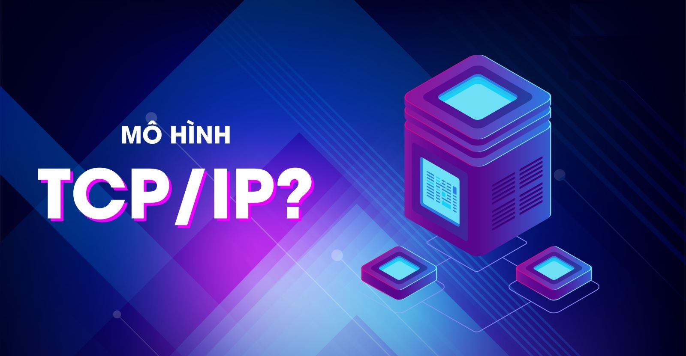
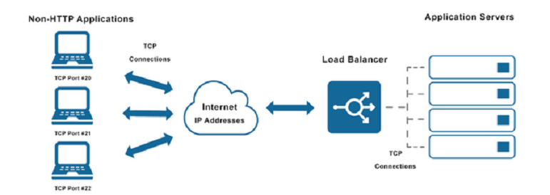
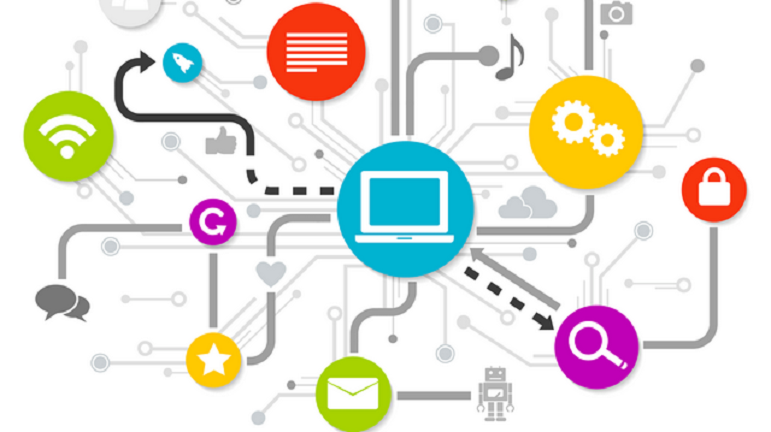
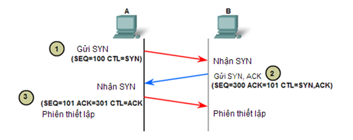
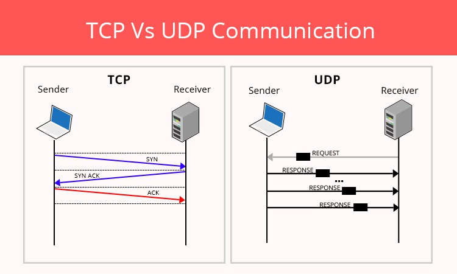

# Mô hình TCP/IP
## Mô hình TCP/IP là gì?
**TCP/IP (Transmission Control Protocol/Internet Protocol)** là bộ giao thức truyền thông quan trọng và là nền tảng của mạng Internet, chịu trách nhiệm về việc kết nối các thiết bị và truyền tải dữ liệu hiệu quả. Bộ giao thức này hoạt động bằng cách chia nhỏ thông tin thành các gói dữ liệu, định tuyến chúng đến đúng địa chỉ đích, và đảm bảo chúng được tập hợp lại chính xác tại điểm nhận.

**Vai trò của các giao thức chính**:
- **TCP (Transmission Control Protocol)**: Đảm bảo việc truyền dữ liệu đáng tin cậy và có thứ tự. TCP thiết lập kết nối giữa người gửi và người nhận, chia dữ liệu thành các gói, và đảm bảo chúng đến nơi đầy đủ, chính xác bằng cách phát hiện lỗi và yêu cầu truyền lại.
- **IP (Internet Protocol)**: Chịu trách nhiệm định địa chỉ và định tuyến dữ liệu. Mỗi thiết bị trên mạng có một địa chỉ IP riêng, và IP sẽ xác định con đường hiệu quả nhất để các gói dữ liệu đi qua mạng đến đúng địa chỉ đích.
## Các Layer trong mô hình TCP/IP
**Lớp 1: Lớp vật lý - Physical**
1. **Khái niệm**: là tầng thấp nhất, chịu trách nhiệm truyền tín hiệu số thành các tín hiệu vật lý (như sóng điện, sóng quang) để truyền qua môi trường truyền dẫn (cáp, sóng vô tuyến) giữa các thiết bị trong cùng một mạng.
2. **Đặc điểm**:
- **Truyền tải dữ liệu ở dạng bit**: Đây là tầng thực hiện việc chuyển đổi dữ liệu thành các tín hiệu điện tử (bit) để truyền qua các phương tiện vật lý. 
- **Tập trung vào kết nối vật lý**: Tầng này quy định các tiêu chuẩn vật lý cho mạng, bao gồm loại cáp, đầu nối, và các thông số kỹ thuật khác cần thiết để thiết lập kết nối giữa các thiết bị. 
- **Sử dụng tín hiệu đồng bộ**: Các thiết bị ở hai đầu kết nối vật lý phải đồng ý về một quy ước tín hiệu để phân biệt các bit 0 và 1 một cách chính xác.
- **Chịu trách nhiệm về phương tiện truyền dẫn**: Bao gồm cáp, sóng radio, hoặc quang học, và các công nghệ như Bluetooth, NFC, Ethernet.
3. **Chức năng**:
- **Định nghĩa đặc tính vật lý**: Xác định các tiêu chuẩn cho cáp, đầu nối, hiệu điện thế, tần số, và các thông số khác của kết nối vật lý.
- **Đóng gói dữ liệu**: Chuyển đổi gói tin (packet) từ tầng Internet thành các khung (frame) để truyền đi trên mạng.
- **Xử lý địa chỉ**: Chịu trách nhiệm sử dụng địa chỉ vật lý (MAC Address) để định danh và định tuyến dữ liệu đến các thiết bị cụ thể trong cùng mạng nội bộ.

**Lớp 2: Lớp mạng - Internet**
1. **Khái niệm**: Tầng mạng (Network Layer hay Internet Layer) trong mô hình TCP/IP chịu trách nhiệm định tuyến các gói tin (packet) từ nguồn đến đích bằng cách sử dụng Giao thức Internet (IP).
2. **Đặc điểm**:
- **Đóng gói dữ liệu**: Dữ liệu từ tầng trên được chia thành các gói tin (packet) với kích thước phù hợp với mạng.
- **Định tuyến (Routing)**: Đây là chức năng cốt lõi, quyết định đường đi tốt nhất cho gói tin từ nguồn đến đích qua các mạng khác nhau.
- **Kết nối các mạng**: Tầng mạng có nhiệm vụ liên kết các mạng độc lập, tạo thành một mạng lưới rộng lớn hơn (Internet).
3. **Chức năng**:
- **Đóng gói (Packetizing)**: Nhận dữ liệu từ tầng trên, đóng gói chúng thành các đơn vị dữ liệu gọi là gói tin (packet) và thêm một phần đầu (header) chứa thông tin định tuyến.
- **Định địa chỉ (Addressing)**: Sử dụng địa chỉ IP để xác định duy nhất từng thiết bị trên mạng, giống như địa chỉ nhà.
- **Xử lý lỗi (Error Handling)**: Giao thức ICMP được sử dụng trong tầng này để báo cáo lỗi và gửi thông báo liên quan đến các sự cố mạng.

**Lớp 3: Lớp vận chuyển - Transport**
1. **Khái niệm**: là tầng thứ ba, có vai trò xử lý giao tiếp đầu cuối giữa các ứng dụng trên các thiết bị khác nhau, sử dụng hai giao thức chính là TCP (đảm bảo độ tin cậy, thứ tự, sửa lỗi) và UDP (tốc độ cao, không đảm bảo tin cậy).
2. **Đặc điểm**:
- **Phân chia và gom nhóm dữ liệu**: Tầng này nhận dữ liệu từ tầng ứng dụng, chia nhỏ chúng thành các đoạn có kích thước phù hợp, mỗi đoạn có một header chứa thông tin điều khiển và dữ liệu cần truyền.
- **Sử dụng các cổng (Ports)**: Để phân biệt các ứng dụng khác nhau trên cùng một thiết bị, tầng giao vận sử dụng các cổng TCP và UDP, cho phép nhiều ứng dụng cùng lúc sử dụng mạng.
3. **Chức năng**:
- **Kiểm soát luồng (Flow Control)**: Điều chỉnh tốc độ truyền dữ liệu để tránh làm quá tải các thiết bị nhận có kết nối chậm, đảm bảo quá trình truyền dữ liệu diễn ra hiệu quả.
- **Kiểm soát lỗi (Error Control)**: Đảm bảo dữ liệu được nhận đầy đủ và đúng thứ tự. Nếu có lỗi hoặc gói tin bị mất, tầng này sẽ yêu cầu truyền lại để đảm bảo tính toàn vẹn của dữ liệu.

**Lớp 4: Lớp ứng dụng - Application**
1. **Khái niệm**: là tầng cao nhất trong mô hình TCP/IP, chịu trách nhiệm giao tiếp trực tiếp với người dùng và các ứng dụng, cho phép các dịch vụ mạng như duyệt web (HTTP), gửi email (SMTP), và truyền tệp (FTP) hoạt động.
2. **Đặc điểm**: cung cấp các dịch vụ mạng cho người dùng và ứng dụng thông qua các giao thức như HTTP, FTP, SMTP, SSH, v.v. Nó nằm ở lớp trên cùng của mô hình, chịu trách nhiệm cho việc trao đổi dữ liệu chuẩn hóa, xử lý các định dạng dữ liệu byte-to-byte và kết hợp thông tin định tuyến để đảm bảo các gói tin được gửi đến đích chính xác.
3. **Chức năng**:
- **Giao tiếp với ứng dụng người dùng**: Tầng ứng dụng cung cấp giao diện cho phép người dùng và các ứng dụng giao tiếp với môi trường mạng.
- **Định dạng và xử lý dữ liệu**: Dữ liệu ở tầng này được định dạng thành các luồng byte và chứa thông tin cần thiết để xác định đường dẫn chính xác của gói tin, đảm bảo giao tiếp thành công.
## So sánh với mô hình OSI
`Giống nhau`
- Đều là mô hình mạng phân tầng
- Nguyên tắc đóng gói dữ liệu giống nhau
- Mỗi lớp hoạt động độc lập, có thể thay đổi công nghệ bên trong mà không ảnh hưởng toàn bộ hệ thống.
- Đều mô tả cách dữ liệu đi từ máy A sang máy B

`Khác nhau`
| |Mô hình OSI|Mô hình TCP/IP|
|-|-----------|--------------|
|Số tầng|7 tầng|4 tầng|
|Tính chất|Mô hình tham chiếu lý thuyết (chủ yếu dùng trong giảng dạy)|Bộ giao thức thực tế được sử dụng trên Internet|
|Mức độ chi tiết|Chia nhỏ từng chức năng (Session, Presentation riêng)|Gộp nhiều chức năng vào tầng Application|
|Địa chỉ sử dụng|- MAC Address (Data Link) - IP Address (Network) - Port (Transport)|- MAC Address (Link) - IP Address (Internet) - Port (Transport)|
|Đơn vị dữ liệu|- Bits (Physical) - Frame (Data Link) - Packet (Network) - Segment/Datagram (Transport) - Data (các tầng trên)|- Frame (Link) - Packet (Internet) - Segment (TCP) / Datagram (UDP) - Data (Application) |
|Thiết bị hoạt động|- Hub (Physical) - Switch (Data Link) - Router (Network) - Gateway (Application)|- Switch (Link) - Router (Internet)|
|Ứng dụng|Dùng để nghiên cứu, học lý thuyết, chuẩn hoá|Dùng trực tiếp trong thực tế (Internet, LAN, WAN)|
|Đơn vị nghiên cứu|ISO phát triển(1984)|ARPANET phát triển (1970s)|
 

## Workflow với mô hình TCP/IP (các bước khi mà A muốn gửi 1 thông tin đến B)

`Máy gửi`

- **Lớp Ứng dụng**: Chuẩn bị dữ liệu được tạo ra và chuyển xuống các lớp dưới.
- **Lớp Giao vận**: Dữ liệu từ lớp ứng dụng được chia thành các segment (TCP) hoặc datagram (UDP) nhỏ hơn.
- **Lớp Internet**: Mỗi gói tin của lớp giao vận được đóng gói lại thành một datagram, thêm địa chỉ IP nguồn và đích để định tuyến trên mạng. 
- **Lớp vật lý**: Datagram được chuyển thành các frame và truyền qua phương tiện vật lý (như cáp Ethernet, Wi-Fi) đến thiết bị đích.

`Máy nhận`

- **Lớp vật lý**: Gói tin được nhận và chuyển thành dạng phù hợp để xử lý ở lớp trên.
- **Lớp Internet**: Địa chỉ IP được kiểm tra để xác định gói tin đã đến đúng đích hay chưa.
- **Lớp giao vận**: TCP (nếu dùng) kiểm tra số thứ tự để sắp xếp lại các segment, xác nhận dữ liệu có bị mất hay lỗi không, và yêu cầu gửi lại nếu cần.
- **Lớp ứng dụng**: Dữ liệu hoàn chỉnh được ghép lại và chuyển đến ứng dụng tương ứng (ví dụ: trình duyệt web hiển thị nội dung).
## Tìm hiểu về giao thức TCP/UDP và so sánh giữa chúng
I. Giao thức TCP
1. TCP (Tranmission Control Protocol) là giao thức truyền tải hướng kết nối (connection-oriented), nghĩa là phải thực hiện thiết lập kết nối với đầu xa trước khi thực hiện truyền dữ liệu. Tiến trình thiết lập kết nối ở TCP được gọi là tiến trình bắt tay 3 bước (threeway handshake).
2. Cấu trúc TCP header: bao gồm 10 trường chính với tổng cộng 20 byte bắt buộc.

Chi tiết các trường trong TCP Header:

|**Tên trường TCP**|**Chức năng**|
|------------------|-------------|
|Cổng nguồn (Source Port)|Xác định số cổng của ứng dụng gửi dữ liệu. |
|Cổng đích (Destination Port)|Xác định số cổng của ứng dụng nhận dữ liệu. |
|Số thứ tự (Sequence Number)|Dùng để đánh số thứ tự các byte dữ liệu, giúp xác định thứ tự truyền và tính ra tổng số byte đã được truyền.|
|Số xác nhận (Acknowledgment Number)|Xác nhận đã nhận được gói tin nào và thông báo byte nào được mong đợi tiếp theo.|
|Độ dài tiêu đề (Data Offset / Header Length)|Cho biết độ dài của toàn bộ phần TCP Header, tính bằng đơn vị word (1 word = 4 byte).|
|Trường dự phòng (Reserved)|Luôn được thiết lập bằng 0 và có thể được sử dụng trong tương lai.|
3. Quá trình bắt tay 3 bước

Giả sử host A muốn truyền dữ liệu cho host B thông qua một kết nối TCP. Trước khi thực hiện truyền , host A cần phải thiết lập kết nối TCP với host B việc này được tiến hành thông qua quá trình bắt tay 3 bước như sau:
- Bước 1: Host A gửi cho B một gói tin có cờ SYN được bật lên, với số thứ tự được đánh là 100. Segment đầu tiên này không chứa phần dữ liệu nên không có phần data, tuy nhiên số lượng byte dữ liệu vẫn được tính là một byte cho hoạt động gửi cờ SYN.
- Bước 2: Host B nhận được gói tin thì B gửi lại gói tin có cờ SYN được bật lên, kèm theo đó là cờ ACK để xác nhận.
- Bước 3: Sau khi kết nối đã được thiết lập thì A gửi lại gói tin để đáp ứng nhu cầu của B.

Sau khi 3 bước được hoàn tất , kết nối TCP được thiết lập giữa host A và B, lúc này 2 host đã có thể truyền dữ liệu được với nhau.

II. Giao thức UDP
 1. UDP (User Datagram Protocol)là giao thức truyền tải hướng không kết nối (connectionless). Nó sẽ không thực hiện thao tác xây dựng kết nối trước khi truyền dữ liệu mà thực hiện truyền ngay lập tức khi có dữ liệu cần truyền (kiểu truyền best effort) => truyền tải rất nhanh cho dữ liệu của lớp ứng dụng.
 2. Cấu trúc UDP header: UDP gói các datagram bằng một tiêu đề UDP, chứa bốn trường, tổng cộng là tám byte.

 |**Tên trường UDP**|**Chức năng**|
 |------------------|-------------|
 |Cổng nguồn (Source Port)|Xác định số cổng của ứng dụng hoặc dịch vụ gửi gói tin.|
 |Cổng đích (Destination Port)|Xác định số cổng của ứng dụng hoặc dịch vụ nhận gói tin.|
 |Độ dài (Length)|Chỉ định tổng chiều dài của toàn bộ datagram, bao gồm cả phần header (tiêu đề) và phần dữ liệu tải trọng (payload).|
 |Checksum (Kiểm tra tổng)|Cung cấp tính năng kiểm tra lỗi để đảm bảo tính toàn vẹn của tiêu đề và dữ liệu của gói tin.|

 III. So sánh UDP và TCP
 - **GIống nhau**: đều là các giao thức mạng TCP/IP, có chức năng kết nối các máy lại với nhau và có thể gửi dữ liệu cho nhau….
- Khác nhau

|TCP|UDP|
|---|---|
|Hướng kết nối|Hướng không kết nối|
|Độ tin cậy cao|Độ tin cậy thấp|
|Gửi dữ liệu dạng luồng byte|Gửi đi Datagram|
|Không cho phép mất gói tin|Cho phép mất gói tin
|Đảm bảo việc truyền dữ liệu|Không đảm bảo việc truyền dữ liệu
|Có sắp xếp thứ tự các gói tin|Không sắp xếp thứ tự các gói tin
|Tốc độ truyền thấp hơn UDP|Tốc độ truyền cao|

