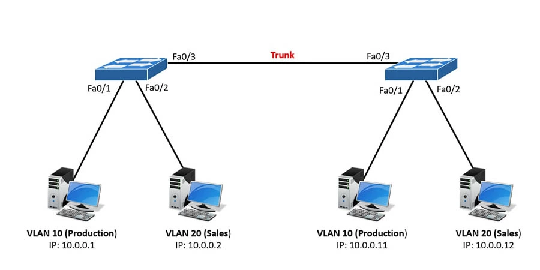
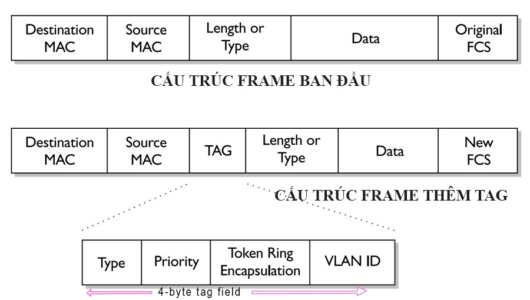
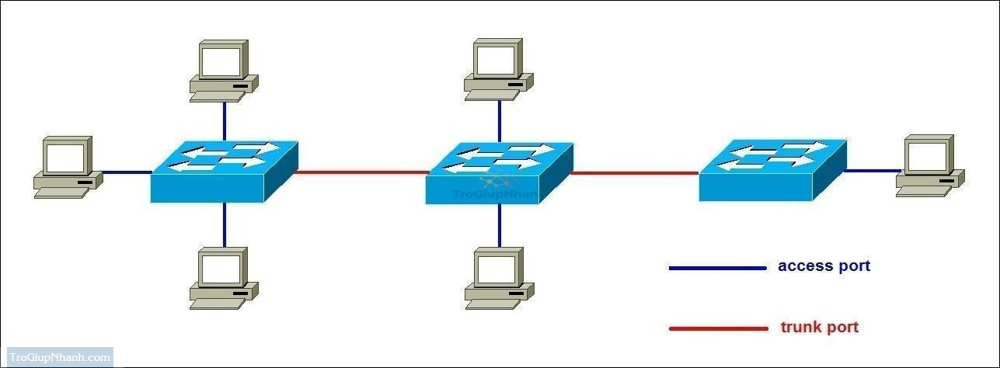

# Tìm hiểu về TRUNK
## Trunk là gì?
Trunk (cổng trunk hoặc đường trunk) là một kết nối vật lý giữa hai bộ chuyển mạch (switch) hoặc giữa switch và router cho phép truyền lưu lượng của nhiều VLAN cùng lúc qua một liên kết duy nhất, sử dụng cơ chế gắn thẻ VLAN ID theo chuẩn IEEE 802.1Q để phân biệt các VLAN.



## Chuẩn IEEE 802.1Q (DOT1Q)
1. Khái niệm
Chuẩn IEEE 802.1Q là một tiêu chuẩn mạng định nghĩa phương pháp gắn thẻ (tagging) VLAN vào các khung dữ liệu Ethernet để cho phép các «mạng cục bộ ảo» (VLAN) trên các mạng Ethernet hoạt động cùng nhau.



**Chức năng chính của IEEE 802.1Q**
- **VLAN Tagging:** 802.1Q thêm một thẻ 4-byte vào khung Ethernet, còn được gọi là «thẻ Dot1q». Thẻ này bao gồm 12-bit VLAN ID (từ 0 đến 4095), cho phép phân loại và quản lý tới 4096 VLAN khác nhau.
- **Giao thức Trunking:** Giao thức này cho phép các cổng trung kế (trunk ports) trên thiết bị chuyển mạch truyền lưu lượng của nhiều VLAN qua một kết nối vật lý duy nhất, trong khi vẫn giữ chúng tách biệt.
- **Ưu tiên chất lượng dịch vụ (QoS):** Thẻ 802.1Q cũng bao gồm 3 bit PRI (Priority) để phân loại lưu lượng, cho phép ưu tiên các loại dữ liệu quan trọng hơn.
- **VLAN gốc (Native VLAN):** Giao thức hỗ trợ «VLAN gốc» cho phép truyền một số lưu lượng không gắn thẻ (untagged) qua các cổng trung kế, giúp tương thích với các thiết bị cũ hơn.

**Cách hoạt động**
- Switch thêm VLAN tag (802.1Q header) vào frame để đánh dấu VLAN. Gói tin sau khi gắn tag sẽ đi qua đường trunk.
- Switch đọc VLAN ID trong tag → xác định gói tin thuộc VLAN nào. Sau đó quyết định có forward đến port nào (dựa trên VLAN table).
- Switch sẽ loại bỏ VLAN tag (untag) trước khi gửi ra cho thiết bị đầu cuối (PC, laptop…), vì thiết bị thường không hiểu VLAN tag.

**Cấu trúc thẻ VLAN (802.1Q VLAN Tag - 4 byte)**

Một Ethernet frame bình thường có cấu trúc:
```
[Dest MAC][Src MAC][EtherType][Payload][FCS]
```
Khi dùng 802.1Q, sẽ chèn thêm VLAN Tag (4 byte) ngay sau địa chỉ MAC nguồn:
```
[Dest MAC][Src MAC][802.1Q Tag][EtherType][Payload][FCS]
```
Trong đó, 802.1Q Tag (4 byte) gồm:
- TPID (Tag Protocol Identifier – 16 bit): Luôn có giá trị 0x8100 → báo hiệu đây là frame có VLAN tag.
- TCI (Tag Control Information – 16 bit): gồm 3 trường nhỏ:
  - Priority (3 bit): QoS – ưu tiên gói tin.
  - CFI/DEI (1 bit): chỉ ra định dạng khung (Canonical Format Indicator).
  - VLAN ID (12 bit): chỉ VLAN mà frame thuộc về (giá trị 0–4095, dùng được 1–4094).

Ví dụ:

PC1 thuộc VLAN 10 muốn gửi dữ liệu đến PC2 (cũng VLAN 10) qua 2 switch nối bằng trunk:
- Switch1 gắn VLAN tag 10 → gửi qua trunk.
- Switch2 đọc VLAN tag 10 → chuyển frame vào các port thuộc VLAN 10.
- Khi frame ra cổng nối PC2 (access port VLAN 10) → tag bị bỏ đi.

## CHUẨN ISL (Inter Switch Link) của Cisco
### Khái niệm
**Chuẩn ISL** là giao thức đóng gói VLAN của Cisco và chỉ được hỗ trợ trên một số thiết bị Cisco qua các liên kết Fast và Gigabit Ethernet.
### Cách hoạt động của ISL
- Switch đóng gói toàn bộ Ethernet frame vào trong ISL header và ISL trailer.
- Header ISL có độ dài 26 byte, Trailer 4 byte → tổng cộng thêm 30 byte.
- Trong header ISL có chứa VLAN ID (10 bit → tối đa 1024 VLAN).
### Cấu trúc ISL Header
|Thành phần|Kích thước|Ý nghĩa|
|----------|----------|-------|
|DA (Destination Address)|6 byte|Địa chỉ MAC đích|
|Type|2 byte|Xác định gói tin là ISL|
|User Field|1 byte|Độ ưu tiên|
|VLAN ID|15 byte|Chứa VLAN của gói tin|
|SA (Source Address)|6 byte|Địa chỉ MAC nguồn|
|Tổng cộng|30 byte|Header ISL|

Ví dụ VLAN Tagging với ISL
- Gói tin từ VLAN 20 khi đi qua Trunk Port sẽ bọc toàn bộ bằng header ISL.
- Switch nhận được sẽ kiểm tra header ISL để xác định VLAN.
## CỔNG ACCESS VÀ CỔNG TRUNK


I. **CỔNG ACCESS (Cổng Truy cập)**
1. Định nghĩa
- **Access Port** là cổng trên switch được cấu hình để thuộc về một VLAN duy nhất.
- Nó được dùng để kết nối trực tiếp tới thiết bị đầu cuối như: PC, laptop, máy in, camera IP...
- Các gói tin đi vào/ra Access Port sẽ không mang VLAN tag (untagged).
2. Đặc điểm của Access Port
- Mỗi Access Port chỉ thuộc 1 VLAN duy nhất.
- Frame đi vào/ra cổng Access đều không chứa VLAN tag (untagged).
- Người dùng/thiết bị không thấy sự tồn tại của VLAN → switch làm việc này trong “nội bộ”.
3. Cấu hình cơ bản
```
Switch(config)# interface fastEthernet 0/1
Switch(config-if)# switchport mode access
Switch(config-if)# switchport access vlan 10
```
Ý nghĩa:
- Cổng F0/1 được cấu hình là Access Port.
- Cổng này gán vào VLAN 10.

II. **Cổng Trunk (Cổng Trung kế)**
1. Định nghĩa:
- **Trunk Port** là cổng trên switch được cấu hình để truyền nhiều VLAN cùng lúc giữa các thiết bị mạng (switch–switch, switch–router, switch–server hỗ trợ VLAN).
- Khác với Access Port (chỉ 1 VLAN), Trunk Port có thể mang nhiều VLAN bằng cách gắn thẻ (tag) VLAN ID vào mỗi frame Ethernet.
2. Đặc điểm của Trunk Port
- Hỗ trợ nhiều VLAN cùng lúc.
- Frame đi qua thường có VLAN tag (trừ Native VLAN).
- Dùng để liên kết các switch hoặc kết nối router (router-on-a-stick).
- Băng thông thường cao hơn vì phải phục vụ nhiều VLAN.
3. Cấu hình cơ bản
```
Switch(config)# interface fastEthernet 0/1
Switch(config-if)# switchport mode trunk
Switch(config-if)# switchport trunk encapsulation dot1q
Switch(config-if)# switchport trunk allowed vlan 10,20
```
Ý nghĩa:
- Cổng F0/1 được cấu hình là Trunk Port.
- Sử dụng chuẩn 802.1Q.
- Chỉ cho phép VLAN 10 và VLAN 20 đi qua trunk này.

III. **So sánh cổng ACCESS VÀ cổng TRUNK**

|**Đặc điểm**|**Access Port**|**Trunk Port**|
|------------|---------------|--------------|
|VLAN hỗ trợ|1 VLAN duy nhất|Nhiều VLAN (gắn VLAN tag 802.1Q hoặc ISL)|
|Đối tượng kết nối|Thiết bị đầu cuối (PC, máy in...)|Switch – Switch, Switch – Router|
|Frame truyền ra|Untagged (không VLAN tag)|Tagged (có VLAN tag, trừ Native VLAN)|
|Ứng dụng|Người dùng|Liên kết mạng|

## VTP, STP
I. **VTP (VLAN Trunking Protocol)**
1. Định nghĩa: 
VTP (VLAN Trunking Protocol) là giao thức quản lý VLAN, giúp đồng bộ hóa cấu hình VLAN trên các switch, còn STP (Spanning Tree Protocol) là giao thức ngăn chặn vòng lặp (loop) trong mạng bằng cách tạo ra một cấu trúc mạng không có vòng lặp. VTP giúp đơn giản hóa việc quản lý VLAN ở các mạng lớn, trong khi STP đảm bảo tính ổn định và tính sẵn sàng của mạng bằng cách tránh các vòng lặp có thể gây ra sự cố. 
2. Mục đích
- Tự động đồng bộ VLAN trên toàn bộ hệ thống mà không cần cấu hình thủ công từng Switch.
- Giảm thiểu lỗi cấu hình khi triển khai mạng lớn.
- Tiết kiệm thời gian vì chỉ cần tạo VLAN trên một Switch, tất cả các Switch khác trong cùng hệ thống VTP sẽ nhận được.
3. Cách hoạt động

VTP cho phép các switch trao đổi thông tin về VLAN và đồng bộ cấu hình VLAN trên toàn bộ mạng. Một switch được cấu hình làm máy chủ VTP sẽ quản lý các VLAN và sau đó phân phối thông tin này cho các switch khác.

4. Các chế độ của VTP
- Server mode (mặc định):
  - Có thể tạo, xóa, chỉnh sửa VLAN.
  - VLAN được đồng bộ sang các switch khác trong cùng domain.
- Client mode:
  - Không thể tạo/xóa VLAN.
  - Chỉ nhận và áp dụng cấu hình VLAN từ VTP Server.
- Transparent mode:
  - Không tham gia đồng bộ VLAN.
  - VLAN tạo trên switch này chỉ có hiệu lực cục bộ.
  - Vẫn chuyển tiếp thông tin VTP đi qua các trunk.

II. **STP (Spanning Tree Protocol)**
