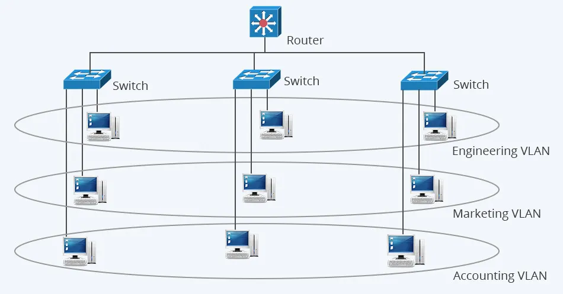
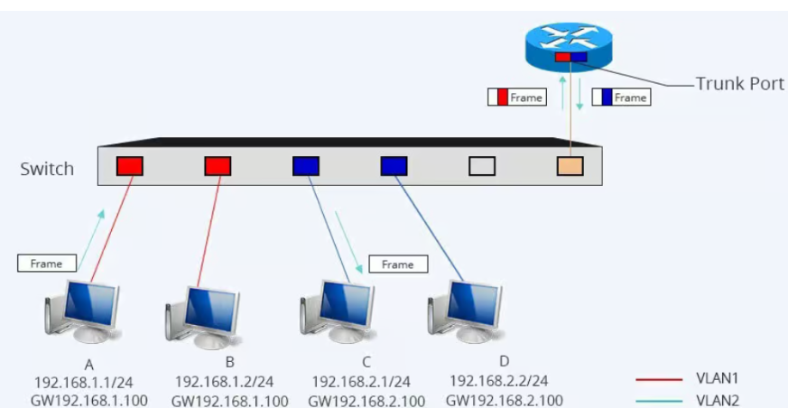

# Tìm hiểu về VLAN
## Mục đích chia VLAN
1. **Tăng cường bảo mật:**
- VLAN tạo ra các "phòng" mạng riêng biệt, nơi các thiết bị trong các VLAN khác nhau không thể giao tiếp trực tiếp với nhau, trừ khi được cấu hình định tuyến rõ ràng.
- Giúp ngăn chặn truy cập trái phép vào dữ liệu nhạy cảm, hạn chế sự lây lan của virus và phần mềm độc hại.
2. **Cải thiện hiệu suất mạng:**
- Mỗi VLAN hoạt động như một miền quảng bá (broadcast domain) riêng biệt.
- Khi lưu lượng broadcast (gói tin được gửi đến tất cả các thiết bị trong mạng) chỉ được giới hạn trong VLAN tương ứng, nó sẽ giảm đáng kể lưu lượng không cần thiết trên toàn mạng.
- Kết quả là giảm tắc nghẽn mạng, cải thiện hiệu suất chung và đảm bảo chất lượng dịch vụ cho các ứng dụng quan trọng như thoại IP.
3. **Tăng tính linh hoạt và quản lý:**
- VLAN cho phép bạn nhóm các thiết bị lại với nhau dựa trên chức năng hoặc phòng ban thay vì vị trí địa lý vật lý.
- Bạn có thể dễ dàng di chuyển một thiết bị sang một VLAN khác mà không cần thay đổi cấu trúc dây cáp vật lý, chỉ bằng cách cấu hình lại cổng switch.
- Điều này đơn giản hóa việc quản lý mạng, đặc biệt là khi cần mở rộng hoặc thay đổi cấu trúc mạng.
4. **Tối ưu hóa việc phân bổ tài nguyên:**
- Mỗi VLAN có thể được quản lý độc lập về tài nguyên, giúp phân chia băng thông và địa chỉ IP hiệu quả hơn.
- Bạn có thể áp dụng các chính sách quản lý lưu lượng riêng cho từng VLAN, như ưu tiên lưu lượng thoại trên một VLAN riêng.
## Tổng quan về VLAN
### VLAN là gì?
VLAN(Virtual Local Area Network) hay còn gọi là mạng LAN ảo là mạng tùy chỉnh được hình thành từ một hoặc nhiều mạng LAN khác nhau, giúp các nhóm thiết bị có thể kết nối với một mạng dùng không đặt cùng nhau.

### Cách VLAN hoạt động
VLAN hoạt động bằng cách gắn các **khung Ethernet** với một mã **VLAN (VLAN ID)**, xác định VLAN mà khung Ethernet thuộc về. Khi thiết bị gửi khung Ethernet, nó thêm mã VLAN vào khung. Khi khung Ethernet đến bộ chuyển mạch, bộ chuyển mạch đọc mã VLAN và chuyển khung đến cổng phù hợp với VLAN tương ứng.

Các bước chi tiết về cách hoạt động của VLAN:
- **Gửi khung Ethernet**: Thiết bị gắn mã VLAN vào khung Ethernet trước khi gửi.
- **Chuyển khung đến bộ chuyển mạch**: Khung Ethernet sẽ thực hiện truyền dữ liệu qua cáp đến bộ chuyển mạch.
- **Đọc mã VLAN**: Bộ chuyển mạch đọc mã VLAN sẽ thuộc khung Ethernet.
- **Chuyển khung đến cổng tương ứng**: Bộ chuyển mạch định tuyến khung Ethernet đến cổng phù hợp với VLAN xác định bởi mã VLAN.
- **Thiết bị nhận khung**: Thiết bị kết nối tới cổng nhận và xử lý khung Ethernet đó.
### Phân loại VLAN
#### Phân loại theo phương thức tạo VLAN
1. **VLAN dựa trên cổng (Port-based VLAN):**
- Đây là phương pháp đơn giản và phổ biến nhất, trong đó mỗi cổng trên switch được gán cho một VLAN cụ thể.
- Bất kỳ thiết bị nào được cắm vào cổng đó sẽ tự động thuộc về VLAN tương ứng.
- Phổ biến cho các cổng truy cập (access port) nơi chỉ có một VLAN được phép.
2. **VLAN dựa trên giao thức (Protocol-based VLAN):**
- Phân loại thiết bị dựa trên loại giao thức mạng mà chúng sử dụng, ví dụ như địa chỉ IP.
- Ít phổ biến do có thể sử dụng DHCP để quản lý địa chỉ IP, nhưng có thể hữu ích trong các hệ thống chuyên biệt để kiểm soát dữ liệu và bảo mật.
#### Phân loại theo phương thức cấu hình
1. **VLAN tĩnh (Static VLAN):**
- Là phương thức gán thủ công các cổng switch vào một VLAN.
- Khi thiết bị kết nối vào một cổng đã được gán cho VLAN, thiết bị sẽ tự động nhận diện VLAN đó.
2. **VLAN động (Dynamic VLAN):**
- Được tạo bằng phần mềm quản lý, ví dụ như Cisco Work 2000.
- Sử dụng Máy chủ quản lý VLAN (VMPS) để tự động đăng ký các cổng switch vào các VLAN dựa trên địa chỉ MAC nguồn của thiết bị được kết nối.

**Ưu, nhược điểm của VLAN**

`Ưu điểm`
- Hỗ trợ giải quyết các vấn đề thường gặp của broadcast như giảm kích thước của broadcast domain, tăng hiệu suất mạng.
- Dễ dàng thiết lập lớp bảo mật bổ sung, giúp đơn giản hóa việc quản lý thiết bị, quá trình này trở nên đơn giản, dễ dàng hơn.
- Tạo ra các nhóm thiết bị, hỗ trợ phân loại theo chức năng.
- Tổ chức mạng theo vị trí địa lý, giúp nâng cao hiệu suất và giảm độ trễ (latency).
- Bảo vệ thông tin nhạy cảm của người dùng, loại bỏ rào cản vật lý.
- Giúp củng cố bảo mật mạng, tách biệt các máy chủ.
- Tiết kiệm chi phí nhờ không cần thêm phần cứng hoặc cáp.
- Dễ dàng thay đổi IP subnet của người dùng thông qua phần mềm.
- Giảm số lượng thiết bị cần thiết cho cấu trúc kết nối mạng, đồng thời hỗ trợ đơn giản hóa quá trình quản lý các thiết bị vật lý.

`Nhược điểm`
- Packet dễ dàng bị rò rỉ giữa các VLAN.
Packet gặp phải tình trạng inject, tạo điều kiện cho các cuộc tấn công mạng xuất hiện.
- Virus từ hệ thống đơn lẻ dễ dàng lan rộng khắp toàn bộ mạng khi sử dụng.
- Cần có sự hiện diện của một router bổ sung để quản lý công việc trong các mạng lớn.
- Khả năng tương tác có thể gặp khó khăn.
Không thể chuyển tiếp lưu lượng mạng từ mạng VLAN này sang các VLAN khác.
### Ứng dụng của VLAN
Phân chia mạng vật lý thành các mạng logic nhỏ hơn để tăng cường bảo mật, cải thiện hiệu suất mạng bằng cách giảm tắc nghẽn, tối ưu hóa việc sử dụng băng thông và đơn giản hóa việc quản lý mạng. VLAN được triển khai rộng rãi trong các doanh nghiệp, trường học và bệnh viện để cô lập dữ liệu nhạy cảm và cho phép các nhóm thiết bị giao tiếp với nhau một cách an toàn, hiệu quả bất kể vị trí vật lý của chúng.

- **Tăng cường bảo mật**
  - *Phân tách dữ liệu*: VLAN giúp phân chia mạng thành các mạng logic riêng biệt, ngăn chặn việc truy cập trái phép giữa các phòng ban hoặc nhóm người dùng khác nhau. 
  - *Hạn chế lây lan*: Bằng cách tạo ra các miền quảng bá (broadcast domain) riêng cho từng VLAN, VLAN có thể ngăn chặn sự lây lan của virus và các phần mềm độc hại trên toàn bộ mạng.
- **Cải thiện hiệu suất mạng**
  - *Giảm tắc nghẽn*: Khi mạng vật lý được chia thành các VLAN nhỏ hơn, lưu lượng truy cập sẽ được giới hạn trong từng VLAN, giúp giảm thiểu tình trạng tắc nghẽn mạng và tăng hiệu suất tổng thể. 
  - *Tối ưu hóa băng thông*: Các VLAN riêng biệt không chia sẻ băng thông với nhau, do đó, việc sử dụng băng thông được tối ưu hóa hiệu quả hơn, đặc biệt cho các ứng dụng quan trọng.
- **Quản lý mạng dễ dàng hơn**
  - *Quản lý logic*: VLAN cho phép quản trị viên mạng quản lý và cấu hình các nhóm thiết bị một cách logic, bất kể chúng được kết nối với các bộ chuyển mạch khác nhau trong mạng vật lý. 
  - *Linh hoạt di chuyển*: Việc chuyển một thiết bị từ VLAN này sang VLAN khác chỉ đơn giản là thay đổi cấu hình phần mềm trên cổng của bộ chuyển mạch, không yêu cầu thay đổi cấu trúc vật lý. 
### Sự khác biệt giữa mạng LAN và VLAN
|**Tiêu chí so sánh**|**LAN (Local Area Network)**|**VLAN (Virtual Local Area Network)**|
|----|--------|---------|
|**Phạm vi**|Là mạng cục bộ, được giới hạn trong khu vực địa lý nhất định. Ví dụ như tòa nhà, khu dân cư và văn phòng.|Là một mạng ảo được tạo ra để chia phạm vi mạng LAN thành nhiều đoạn ảo, không phụ thuộc vào vị trí địa lý.|
|**Cách tổ chức**|Được tổ chức theo dạng cấu trúc vật lý, các máy tính được kết nối thông qua một cấu trúc chuyển mạch hay Hub.|Tổ chức logic, cho phép các thiết bị thuộc cùng một nhóm thông qua cấu hình phần mềm mà không cần thiết phải kết nối vật lý với nhau.|
|**Quản lý và bảo mật**|Quản lý thông qua cấu hình vật lý của mạng, quá trình bảo mật được vào các biện pháp khác như cấu hình và mật khẩu.|Quá trình quản lý dựa trên cấu hình logic, đảm bảo dữ liệu được bảo mật nhờ tính năng ngăn chặn các truy cập giữa các VLAN khác nhau, đồng thời tăng tính an toàn cho toàn bộ dữ liệu.|
|**Hiệu suất và linh hoạt**|Dễ gặp vấn đề liên quan đến hiệu suất sử dụng, đặc biệt là khi có nhiều máy tính cùng kết nối với một bộ chuyển mạch hoặc một đoạn mạng.|Dễ dàng cải thiện hiệu suất, khả năng linh hoạt thông qua việc chia mạng thành các nhóm ảo, điều này giúp giảm tải lưu lượng trong quá trình hoạt động, đồng thời cải thiện khả năng quản lý dữ liệu của mạng VLAN.|
|**Chi phí và quản lý**|Đòi hỏi phải có cấu hình vật lý, nếu mở rộng chi phí có thể tăng cao hoặc làm thay đổi cấu trúc.|Sử dụng VLAN sẽ giúp doanh nghiệp giảm chi phí và thời gian quản lý nếu cần thay đổi cấu hình mạng, không cần phải thay đổi cấu trúc vật lý.|
