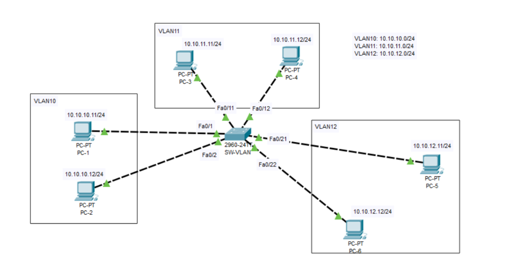

# CHIA VLAN
## Yêu cầu cấu hình VLAN như ảnh

## Các bước thực hiện
1. Truy cập vào switch

Mở Cisco Packet Tracer → Nhấn vào Switch (SW-VLAN) → Chọn CLI.

2. Vào chế độ cấu hình

  - Tạo VLAN
```
Switch> enable
Switch# configure terminal

Switch(config)# vlan 10
Switch(config-vlan)# name VLAN10
Switch(config-vlan)# exit

Switch(config)# vlan 11
Switch(config-vlan)# name VLAN11
Switch(config-vlan)# exit

Switch(config)# vlan 12
Switch(config-vlan)# name VLAN12
Switch(config-vlan)# exit
```

  - Gán VLAN cho từng cổng (Access Port)
```
! VLAN 10
Switch(config)# interface fa0/1
Switch(config-if)# switchport mode access
Switch(config-if)# switchport access vlan 10
Switch(config-if)# exit

Switch(config)# interface fa0/2
Switch(config-if)# switchport mode access
Switch(config-if)# switchport access vlan 10
Switch(config-if)# exit

! VLAN 11
Switch(config)# interface fa0/11
Switch(config-if)# switchport mode access
Switch(config-if)# switchport access vlan 11
Switch(config-if)# exit

Switch(config)# interface fa0/12
Switch(config-if)# switchport mode access
Switch(config-if)# switchport access vlan 11
Switch(config-if)# exit

! VLAN 12
Switch(config)# interface fa0/21
Switch(config-if)# switchport mode access
Switch(config-if)# switchport access vlan 12
Switch(config-if)# exit

Switch(config)# interface fa0/22
Switch(config-if)# switchport mode access
Switch(config-if)# switchport access vlan 12
Switch(config-if)# exit
```
- Kiểm tra VLAN đúng cổng chưa
```
 Switch#show vlan
 ```
 

 Như trong hình là các cổng VLAN đã được ghép đúng cổng

 ## Ping PC để kiểm tra kết nối được thông chưa
1. Chọn PC muốn kiểm tra kết nối: Nhấn vào PC-1 hoặc PC khác trong sơ đồ.
2. Vào tab Desktop → Chọn Command Prompt.
3. Thực hiện lệnh ping:
```
ping [địa_chỉ_IP]
```
Từ PC-1 ping đến PC khác. nếu cùng vlan sẽ trả về reply, khác vlan trả về Request time out.


