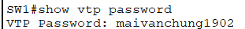

# Cấu hình VTP domain
## Sơ đồ lab:


 ## Cấu hình VTP
 1. Cấu hình chi tiết từng thiết bị
 - PC-1:
IP Address: 192.168.10.11
Subnet Mask: 255.255.255.0
Default Gateway: (Bỏ trống nếu không có Router)
- Các PC khác làm tương tự.
2. Thiết lập VLAN trên 2 switch

**Trên Switch1:**
```
Switch>enable 
Switch#configure terminal 
Switch(config)#hostname SW1
SW1(config)#
```
**Tạo VLAN10 và VLAN20:**
```
SW1(config)#vlan 10
SW1(config-vlan)#name VLAN10
SW1(config-vlan)#exit

SW1(config)#vlan 20
SW1(config-vlan)#name VLAN20
SW1(config-vlan)#exit

SW1(config)#
```
**Gán các port vào các VLAN:**
```
SW1(config)#interface fastEthernet 0/10
SW1(config-if)#switchport access vlan 10
SW1(config-if)#exit

SW1(config)#interface fastEthernet 0/11
SW1(config-if)#switchport access vlan 10
SW1(config-if)#exit

SW1(config)#interface fastEthernet 0/20
SW1(config-if)#switchport access vlan 20
SW1(config-if)#exit

SW1(config)#exit
```
**Kiểm tra kết quả:**


**Trên Switch2:**
```
Switch>enable 
Switch#configure terminal 
Switch(config)#hostname SW2
SW2(config)#
```
**Tạo VLAN10 và VLAN20:**
```
SW2(config)#vlan 10
SW2(config-vlan)#name VLAN10
SW2(config-vlan)#exit

SW2(config)#vlan 20
SW2(config-vlan)#name VLAN20
SW2(config-vlan)#exit

SW2(config)#
```
**Gán các cổng vào VLAN**
```
SW2(config)#interface fastEthernet 0/10
SW2(config-if)#switchport access vlan 10
SW2(config-if)#exit

SW2(config)#interface fastEthernet 0/20
SW2(config-if)#switchport access vlan 20
SW2(config-if)#exit

SW2(config)#exit
```
**kiểm tra lại:**


3. Cấu hình VTP

**Trên SW1:**

Đặt địa chỉ IP cho interface VLAN10 là `192.168.10.1` và VLAN20 là `192.168.20.1`
```
SW1#configure terminal 
SW1(config)#interface vlan 10
SW1(config-if)#
SW1(config-if)#ip address 192.168.10.1 255.255.255.0
SW1(config-if)#no shutdown
SW1(config-if)#exit
SW1(config)#

SW1(config)#interface vlan 20
SW1(config-if)#ip address 192.168.20.1 255.255.255.0
SW1(config-if)#no shutdown 
SW1(config-if)#exit 

SW1(config)#exit
SW1#
```
**Trên SW2:**

Đặt địa chỉ IP cho interface VLAN10 là `192.168.10.2` và VLAN20 là `192.168.20.2`
```
SW2#configure terminal 
SW2(config)#interface vlan 10
SW2(config-if)#
SW2(config-if)#ip address 192.168.10.2 255.255.255.0
SW2(config-if)#no shutdown
SW2(config-if)#exit
SW2(config)#

SW2(config)#interface vlan 20
SW2(config-if)#ip address 192.168.20.2 255.255.255.0
SW2(config-if)#no shutdown 
SW2(config-if)#exit 

SW2(config)#exit
SW2#
```
Thiết lập VTP Server và VTP Client:
- SW 1: VTP Server.
- SW 2: VTP CLient.
- VTP domain : MVC
- VTP password: maivanchung1902

**Trên SW1:**
```
SW1>enable
SW1#configure terminal
SW1(config)#vtp mode server
SW1(config)#vtp domain MVC
SW1(config)#vtp password maivanchung1902
SW1(config)#exit
SW1#
```
**Trên SW2:**
```
SW2>enable
SW2#configure terminal
SW2(config)#vtp mode client
SW2(config)#vtp domain MVC
SW2(config)#vtp password maivanchung1902
SW2(config)#exit
SW2#
```
**Tạo đường trục từ SW1 đến SW2:**

Enable trunking trên các cổng kết nối giữa 2 switch là Fa0/1 trên SW1 và Fa0/1 trên SW2.

**Trên SW1:**
```
SW1#configure terminal
SW1(config)#interface fastEthernet 0/1
SW1(config-if)#switchport mode trunk
SW1(config-if)#end
SW1#
```
**Trên SW2:**
```
SW2#configure terminal
SW2(config)#interface fastEthernet 0/1
SW2(config-if)#switchport mode trunk
SW2(config-if)#end
SW2#
```
4. Các lệnh kiểm tra sau khi cấu hình xong

`SW# show vtp status`

**SW1**


**sw2**


`SW# show vtp password`

**SW1**



**SW2**


`SW# show interfaces trunk`

**SW1**


**SW2**

