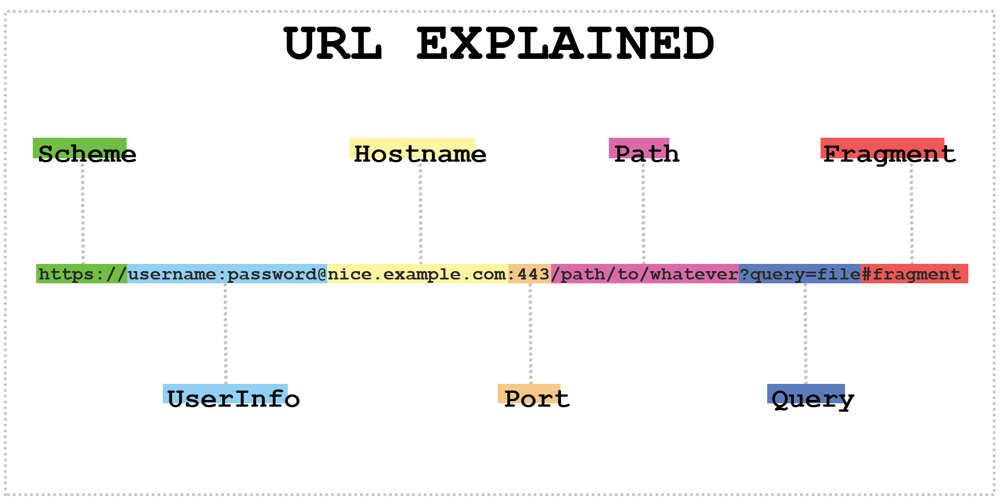

# Tìm hiểu HTTP
## I. HTTP là gì?


**HTTP** là Giao thức truyền tải siêu văn bản (Hypertext Transfer Protocol), là nền tảng cơ bản của World Wide Web, giúp trình duyệt (máy khách) và máy chủ web trao đổi dữ liệu như HTML, hình ảnh, video.

**Cơ chế hoạt động**:
1. **Yêu cầu (Request)**: Khi bạn truy cập một trang web, trình duyệt của bạn sẽ gửi một yêu cầu HTTP đến máy chủ web nơi trang web đó được lưu trữ.
2. **Phản hồi (Response)**: Máy chủ nhận yêu cầu và gửi lại một phản hồi HTTP, chứa các dữ liệu cần thiết để trình duyệt hiển thị trang web cho bạn.
## II. Các đặc trưng cơ bản của HTTP
- **Đơn giản và dễ sử dụng**: HTTP có cấu trúc đơn giản, dễ hiểu và dễ triển khai, giúp các nhà phát triển dễ dàng tích hợp vào ứng dụng web.
- **Mô hình Yêu cầu-Phản hồi (Request-Response)**: Quá trình truyền thông diễn ra theo cơ chế yêu cầu-phản hồi. Client gửi yêu cầu HTTP và Server phản hồi lại với các dữ liệu được yêu cầu.
- **Tính độc lập**: HTTP có thể truyền tải bất kỳ loại dữ liệu nào miễn là Client và Server có cách thức để kiểm soát nội dung, sử dụng các loại MIME phù hợp.
## III. Cấu trúc cơ bản của HTTP
1. **Cấu trúc một HTTP Request**

Một request gồm 3 phần:

- *Request Line*
  - Gồm: phương thức + URL + phiên bản HTTP
  - Ví dụ: `GET /index.html HTTP/1.1`
- *Headers*
  - Cung cấp thông tin phụ như: kiểu dữ liệu, user-agent, cookie, authorization…
  - Ví dụ:
  ```
  Host: www.example.com
  User-Agent: Mozilla/5.0
  Accept: text/html
  ```
- *Body (tùy chọn)*
  - **Chứa dữ liệu gửi kèm** (thường có ở POST, PUT).
  - Ví dụ: Dữ liệu form đăng nhập.

2. **Cấu trúc một HTTP Response**
- *Status Line*

   Ví dụ:
    ```
    HTTP/1.1 200 OK
    ```
 - *Headers*
   - Thông tin phản hồi: loại nội dung, server, thời gian, cookie…
   - Ví dụ:
   ```
   Content-Type: text/html
   Content-Length: 305
   ```
 - *Body*
   - Nội dung thực tế server trả về (HTML, JSON, hình ảnh…).
## IV. URL
**URL** là viết tắt của cụm từ Uniform Resource Locator (còn được gọi là địa chỉ web) được sử dụng để định vị và truy cập đến các tài nguyên trên Internet. Mỗi tài nguyên (trang web, hình ảnh, video, file, document,…) đều có 1 URL duy nhất để dẫn đến nó.



Cấu tạo của một URL như sau:
```
URL = scheme:[//authority]path[?query][#fragment]
```
Trong đó:
- **Scheme**: chính là giao thức mạng sử dụng để truyền dẫn dữ liệu, các giao thức phổ biến mà chúng ta biết là http, https, ftp, mailto, irc…, phân cách giao thức với phần còn lại bằng ký tự `:`.
- **authority** là phần tổ hợp bao gồm các phần nhỏ hơn

```
authority = [userinfo@]domain[:port]
```

  - **userinfo**: Thông tin người dùng bao gồm tên đăng nhập và mật khẩu, chỉ sử dụng với các URL được bảo mật cần đăng nhập.
  - **domain**: tên miền của website là ánh xạ 1 – 1 từ một tên có thể nhớ sang địa chỉ IP của máy chủ web nơi chứa nội dung trang web.
  - **port**: Số cổng sử dụng bởi giao thức trên máy chủ.
- **path**: Đường dẫn đến nội dung trang web, đường dẫn này là đường dẫn trong nội bộ website, phân cách giữa thư mục cha và thư mục con bởi dấu gạch chéo (/).
- **query**: là chuỗi truy vấn, chứa các thông tin theo cặp tên/giá trị được gửi đến máy chủ web, mỗi cặp này cách nhau bởi dấu `&`.
- **fragment**: là các chỉ mục con của nội dung, được bắt đầu với dấu `#`.


