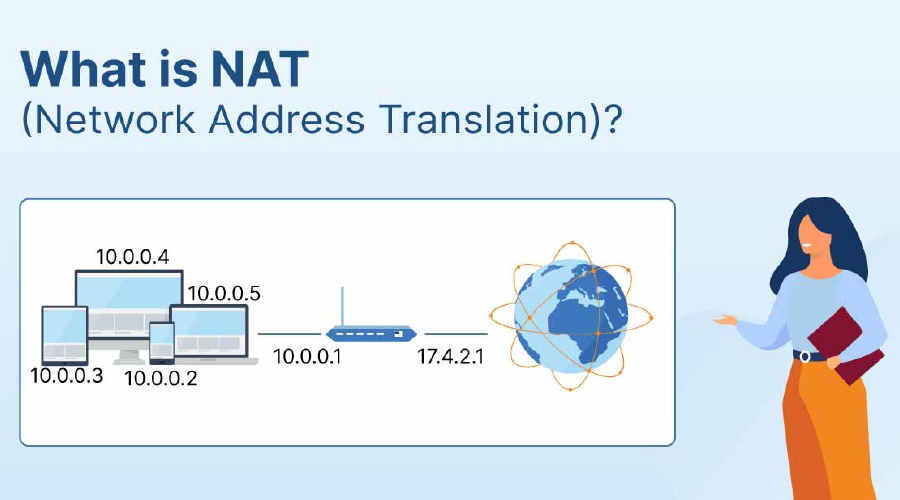
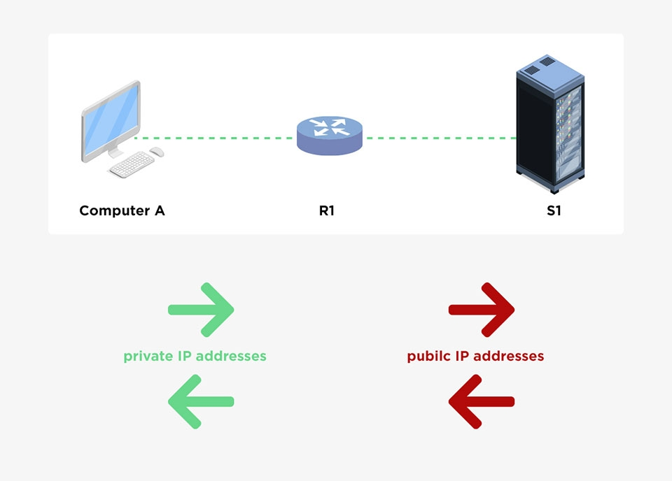
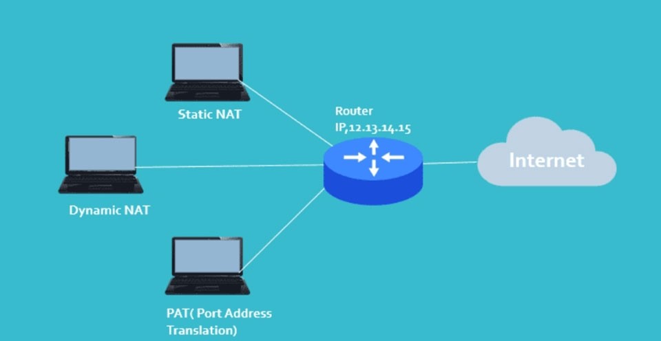

# TÌM HIỂU VỀ NAT
## I. Nat là gì?
NAT (Network Address Translation) là công nghệ dịch địa chỉ mạng, cho phép nhiều thiết bị trong mạng nội bộ sử dụng một địa chỉ IP công cộng duy nhất để truy cập Internet, giúp tiết kiệm IP và tăng cường bảo mật bằng cách ẩn các địa chỉ IP riêng tư.

## Chức năng chính của NAT

- Chia sẻ địa chỉ IP Public: NAT cho phép nhiều thiết bị trong mạng nội bộ (sử dụng địa chỉ IP Private) chia sẻ một hoặc một số địa chỉ IP Public để truy cập internet. Điều này rất quan trọng khi số lượng địa chỉ IP Public có hạn trong IPv4.
- Tăng cường bảo mật: NAT che giấu địa chỉ IP Private của các thiết bị trong mạng nội bộ khỏi internet, giúp bảo vệ mạng khỏi các cuộc tấn công bên ngoài. Thiết bị từ ngoài internet không thể kết nối trực tiếp với các thiết bị có IP Private mà không qua NAT.
- Giảm bớt nhu cầu sử dụng địa chỉ IP Public: Bằng cách sử dụng một hoặc một vài địa chỉ IP Public cho hàng trăm hoặc hàng nghìn thiết bị có IP Private, NAT giúp tiết kiệm đáng kể tài nguyên địa chỉ IP Public.
- Dễ dàng cấu hình mạng nội bộ: NAT cho phép thay đổi, cấu trúc lại địa chỉ IP Private trong mạng nội bộ mà không ảnh hưởng đến địa chỉ IP Public. Điều này tạo ra sự linh hoạt trong việc quản lý và tổ chức mạng nội bộ.
- Hỗ trợ kết nối từ mạng nội bộ ra ngoài internet: Khi một thiết bị trong mạng nội bộ muốn truy cập internet, NAT sẽ ánh xạ địa chỉ IP Private thành địa chỉ IP Public. Điều này cho phép các thiết bị trong mạng nội bộ có thể duy trì kết nối với các dịch vụ và hệ thống trên internet.

## Cách thức hoạt động của NAT
- Gói tin ra ngoài: Khi một thiết bị trong mạng LAN (ví dụ: máy tính của bạn) gửi yêu cầu ra Internet, gói tin sẽ đi qua router.
- Thay đổi IP nguồn: Router sẽ thay đổi địa chỉ IP nguồn của gói tin từ IP riêng tư của thiết bị trong mạng LAN thành địa chỉ IP công cộng của router.
- Lưu trữ thông tin: Router duy trì một bảng ghi lại thông tin về kết nối này, bao gồm IP nguồn (riêng tư), IP đích (công cộng) và các cổng kết nối.
- Gói tin trả về: Khi máy chủ trên Internet gửi gói tin trả lời, gói tin này sẽ đến router với địa chỉ IP đích là IP công cộng.
- Thay đổi IP đích: Router dựa vào bảng ghi nhớ của mình để thay đổi địa chỉ IP đích thành địa chỉ IP riêng tư của thiết bị trong mạng LAN ban đầu và chuyển gói tin đến đúng thiết bị đó.
## Phân loại NAT trong mạng

**NAT (Network Address Translation)** trong mạng có thể được phân loại thành 3 loại chính dựa trên cách thức thực hiện chuyển đổi địa chỉ IP:
- **Static NAT (NAT tĩnh):** Đây là loại NAT cơ bản nhất và thường được sử dụng để chuyển đổi một địa chỉ IP tĩnh trong mạng cục bộ sang một địa chỉ IP công cộng. Trong quá trình chuyển đổi, một địa chỉ IP tĩnh được ánh xạ với một địa chỉ IP công cộng, giúp thiết lập kết nối đến những thiết bị trong mạng cục bộ từ bên ngoài mạng.
- **Dynamic NAT (NAT động):** Đây là loại NAT phổ biến được sử dụng để chuyển đổi một địa chỉ IP động trong mạng cục bộ sang một địa chỉ IP công cộng. Trong quá trình chuyển đổi, NAT sẽ tạo ra một bảng ánh xạ động giữa những địa chỉ IP tĩnh và địa chỉ IP công cộng, cho phép những thiết bị trong mạng cục bộ chia sẻ cùng một địa chỉ IP công cộng.
- **Port Address Translation (PAT):** Đây là loại NAT phức tạp nhất và cũng là loại NAT phổ biến nhất. PAT cho phép chuyển đổi nhiều địa chỉ IP trong mạng cục bộ sang một địa chỉ IP công cộng thông qua nhiều cổng khác nhau. Mỗi kết nối từ những thiết bị trong mạng cục bộ được định tuyến thông qua một cổng duy nhất trên địa chỉ IP công cộng, giúp tiết kiệm địa chỉ IP công cộng và tăng cường bảo mật của mạng.

