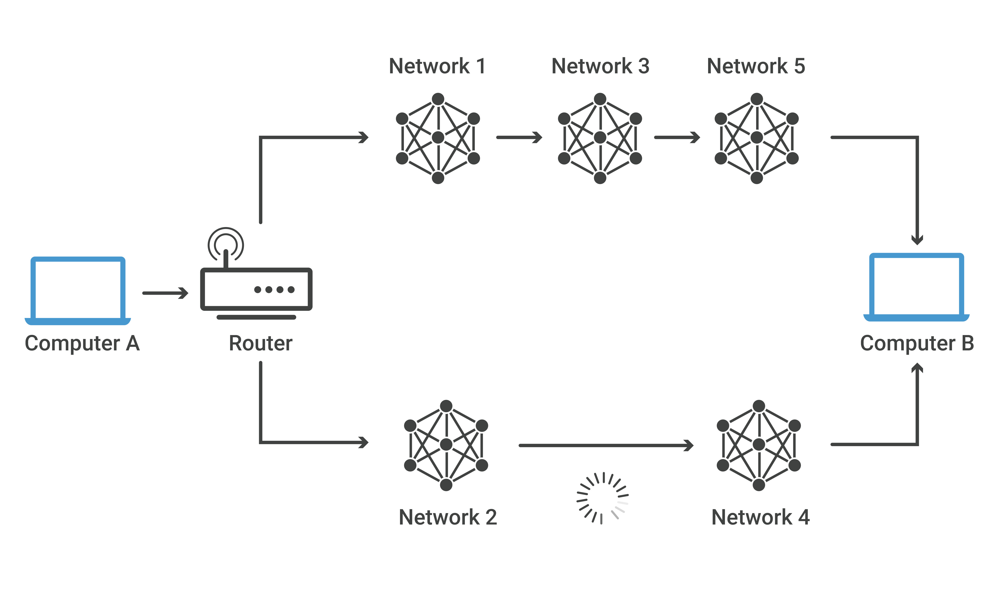
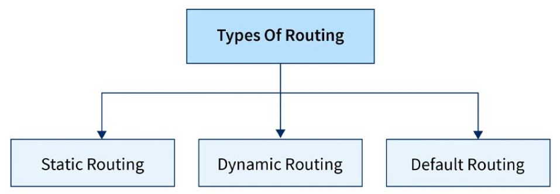

# Tìm hiểu về Routing
**I. KHÁI NIỆM ROUTING**

**Routing (Định tuyến)** là quá trình xác định đường đi tốt nhất để dữ liệu (gói tin) di chuyển từ điểm nguồn đến điểm đích trên một mạng máy tính, được thực hiện thông qua các thiết bị như bộ định tuyến (router). Quá trình này liên quan đến việc phân tích địa chỉ đích, tham khảo bảng định tuyến (routing table) và sử dụng các giao thức định tuyến để chọn đường dẫn hiệu quả nhất.

Ví dụ ảnh trên, máy A gửi dữ liệu cho máy B. Gói tin đi từ A → Router → qua nhiều mạng trung gian (Network 1, 2, 3, 4, 5) → đến B
- Có 2 đường đi khả thi:
1. A → Router → Network 1 → Network 3 → Network 5 → B
2. A → Router → Network 2 → Network 4 → B

Khi dữ liệu từ máy tính A đến Router nó sẽ phân tích và quyết định lựa chọn đường dẫn tốt nhất trong 2 đường dẫn. Trong trường hợp này, Router sẽ chọn đường 1 vì đường truyền từ mạng 2 đến mạng 4 bị chậm.

**II. Router hoạt động như thế nào?**

Router kết nối và điều phối luồng dữ liệu giữa các mạng khác nhau. Nó giúp gửi và nhận các gói tin (data packets) giữa các mạng dựa trên địa chỉ IP.

Router hoạt động tại Layer 3 (Network Layer) trong mô hình OSI (Open System for Interconnection).

Một router có thể kết nối với ít nhất hai mạng cùng lúc, chẳng hạn như:
- Hai mạng LAN (Local Area Networks).
- Hai mạng WAN (Wide Area Networks).
- Một mạng LAN và nhà cung cấp dịch vụ Internet (ISP).

**III. Chức năng của Routing**

- Định Tuyến (Path Selection): Chọn đường đi tối ưu để truyền các gói dữ liệu.

- Chuyển Tiếp Gói (Packet Forwarding): Chuyển tiếp các gói dữ liệu qua các nút mạng trung gian.

- Quản Lý Bảng Định Tuyến (Routing Table Management): Duy trì và cập nhật bảng định tuyến chứa thông tin về các đường đi.

**IV. Phân loại Routing**

Định tuyến (routing) có thể chia thành 3 loại: định tuyến tĩnh, định tuyến mặc định, định tuyến động.

**1. Định tuyến tĩnh (Static routing)**

**Static Routing:** Là quá trình định tuyến mà các tuyến đường được thiết lập thủ công trong bảng định tuyến của router. Các tuyến đường này không thay đổi trừ khi quản trị viên thay đổi thủ công. Đây là phương pháp đơn giản nhưng thiếu khả năng mở rộng.
- **Ưu điểm:** Đảm bảo đường đi cho các gói tin được xác định, an toàn hơn, sử dụng ít tài nguyên router hơn.
- **Nhược điểm:** Không thể tự động thích ứng với sự thay đổi của mạng, tốn thời gian và công sức quản trị khi mạng lớn.

**2. Định tuyến động (dynamic routing)**

- **Dynamic Routing:** Là quá trình định tuyến tự động, nơi các router sử dụng giao thức định tuyến (như RIP, OSPF, BGP) để tự động cập nhật bảng định tuyến dựa trên thông tin từ các router khác trong mạng.
  - **RIP (Routing Information Protocol):** Một giao thức định tuyến động sử dụng thuật toán Distance Vector. RIP hạn chế phạm vi của nó với số lượng nhảy tối đa (15), và không phù hợp cho các mạng lớn.

  - **OSPF (Open Shortest Path First):** Giao thức định tuyến link-state, tối ưu hóa quá trình tìm đường đi ngắn nhất trong mạng lớn hơn so với RIP, và hỗ trợ nhiều tính năng như phân vùng mạng.

  - **BGP (Border Gateway Protocol):** Giao thức định tuyến giữa các hệ thống tự trị (AS), chủ yếu dùng trong Internet để trao đổi thông tin định tuyến giữa các tổ chức lớn.
- **Ưu điểm:** Khả năng thích ứng với sự thay đổi của mạng, tự động điều chỉnh đường đi khi có sự cố, phù hợp với mạng lớn và phức tạp. 

- **Nhược điểm:** Yêu cầu tài nguyên xử lý và bộ nhớ lớn hơn, có thể tạo ra các vòng lặp định tuyến nếu cấu hình sai.

**3. Định tuyến Mặc định (Default Routing)**
Một tuyến đường mặc định được cấu hình để định tuyến tất cả các gói tin không khớp với bất kỳ tuyến đường nào khác trong bảng định tuyến.

- **Ưu điểm:** Đơn giản hóa việc cấu hình, cho phép tất cả lưu lượng không xác định được gửi ra một điểm duy nhất, thường là gateway ra Internet.

- **Nhược điểm:** Mất quyền kiểm soát chi tiết về đường đi của lưu lượng, có thể gây tắc nghẽn nếu gateway mặc định là một nút cổ chai.

**So sánh Static Routing (Định tuyến tĩnh) và Dynamic Routing (Định tuyến động)**

|**Tiêu chí**|**Static Routing (Định tuyến tĩnh)**|**Dynamic Routing (Định tuyến động)**|
|---------------|--------------|--------|
|**Cấu hình**|Quản trị viên nhập thủ công từng route|Router tự động học đường đi thông qua giao thức|
|**Độ phức tạp**|Đơn giản, dễ hiểu|Phức tạp hơn (phải chạy giao thức như RIP, OSPF, EIGRP…)|
|**Khả năng mở rộng**|Khó mở rộng khi mạng lớn (càng nhiều mạng, càng nhiều cấu hình)|Dễ mở rộng, router tự động trao đổi route|
|**Khả năng thích ứng khi sự cố**|Không tự động thay đổi khi có sự cố, phải chỉnh tay|Tự động cập nhật và tìm đường đi mới|
|**Tốn tài nguyên**|Không tốn CPU/RAM, không tiêu thụ băng thông cho cập nhật|Tốn tài nguyên router và băng thông để duy trì thông tin định tuyến|
|**Độ an toàn**|Cao (không quảng bá thông tin ra ngoài)|Thấp hơn (có thể bị tấn công nếu không bảo mật)|
|**Ứng dụng**|Mạng nhỏ, ít thay đổi, hoặc route đặc biệt (ví dụ route mặc định ra Internet)|Mạng doanh nghiệp, ISP, mạng phức tạp, thường xuyên thay đổi|

**V. Các thuật toán routing**

|**Loại**|**Thuật toán**|**Ưu điểm**|**Nhược điểm**|
|----|----------|-------|----------|
|**Distance Vector**|Bellman–Ford|Dễ hiểu, ít tốn tài nguyên|Hội tụ chậm, dễ loop|
|**Link State**|Dijkstra|Chính xác, hội tụ nhanh|Phức tạp, tốn CPU/RAM|
|**Hybrid**|DUAL|Hội tụ nhanh, linh hoạt|Cisco độc quyền|
|**Path Vector**|Path Vector|Ổn định, kiểm soát tốt vòng lặp|Cấu hình phức tạp|