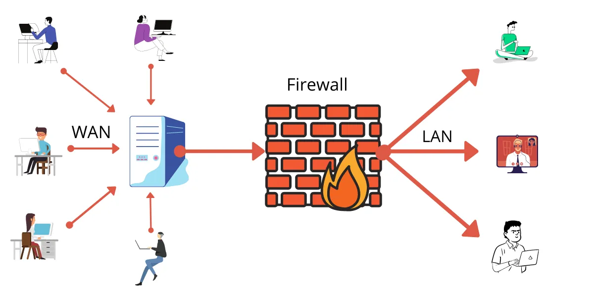
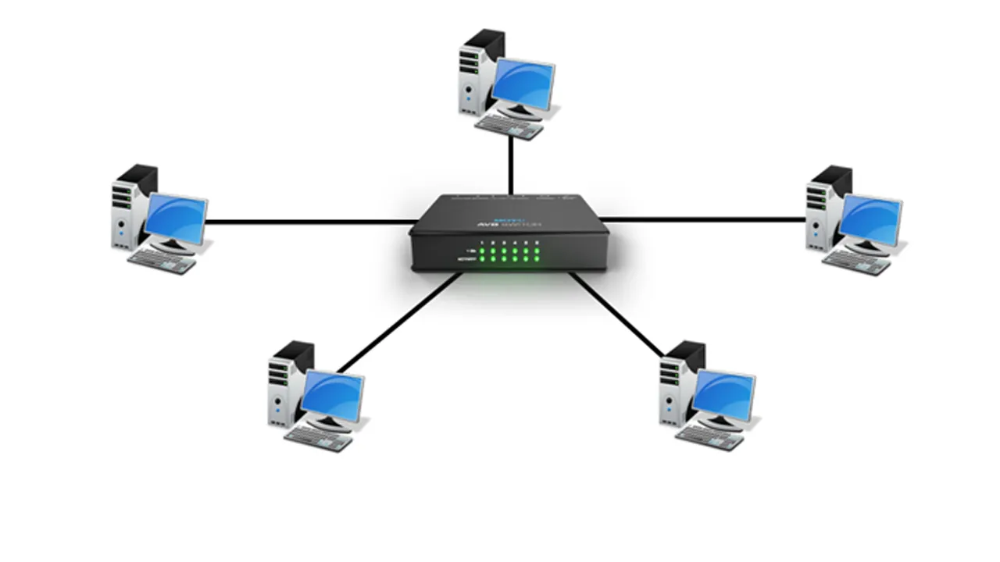
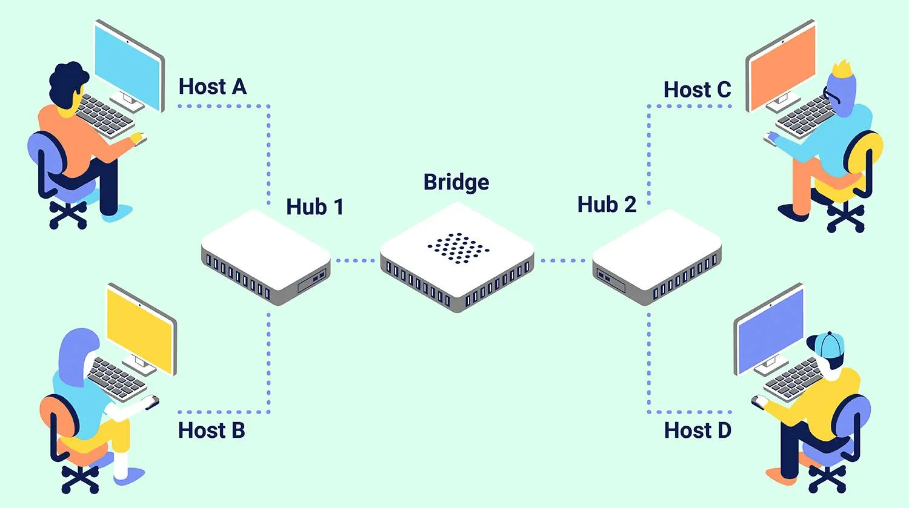
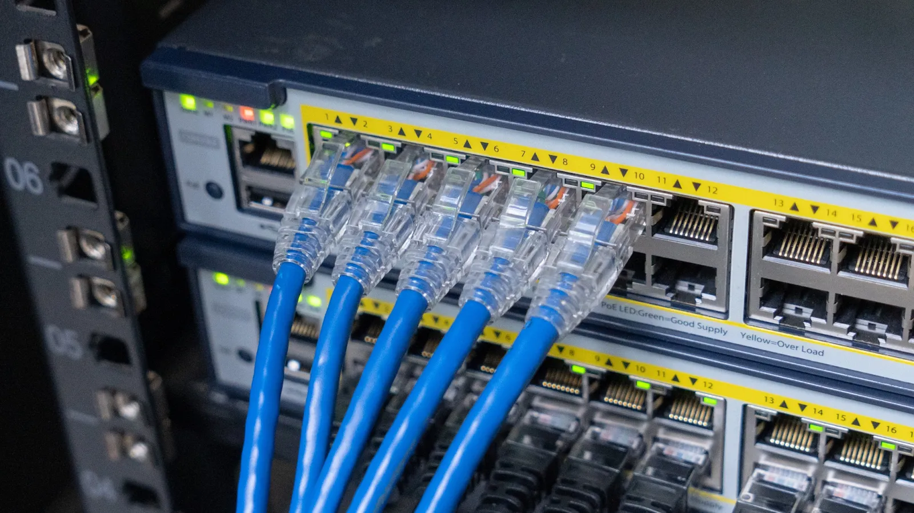
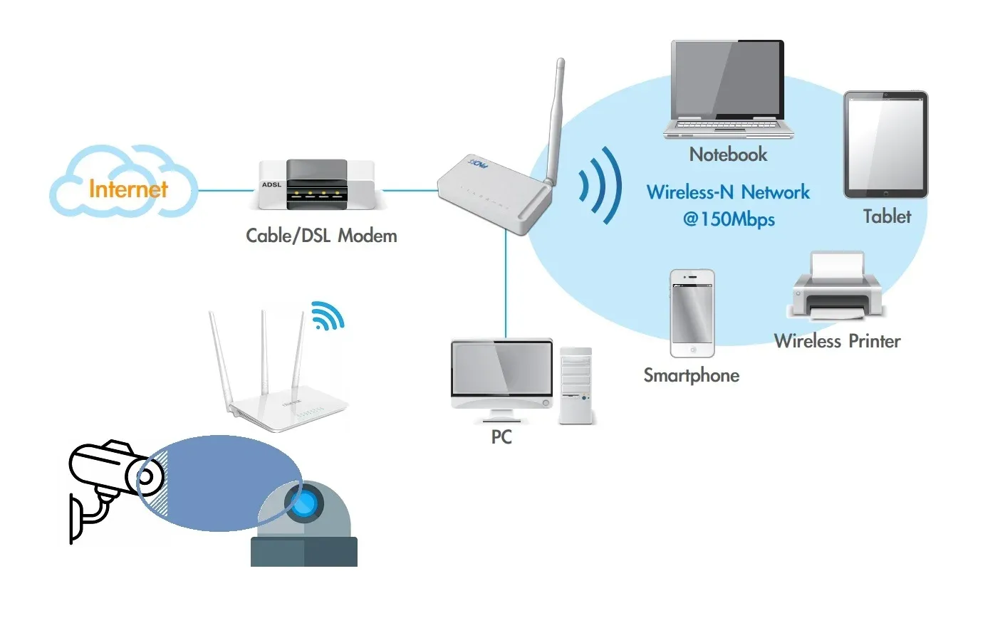
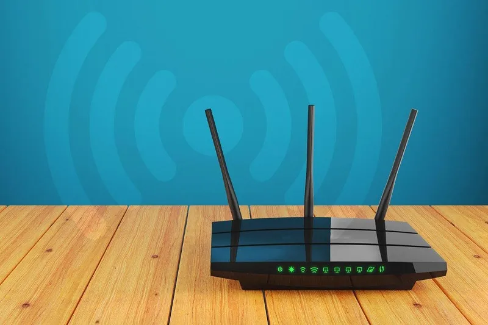
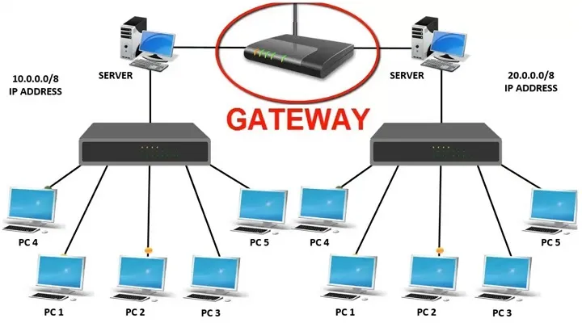
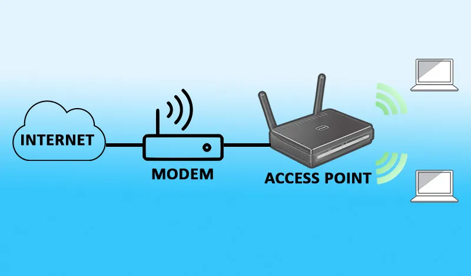
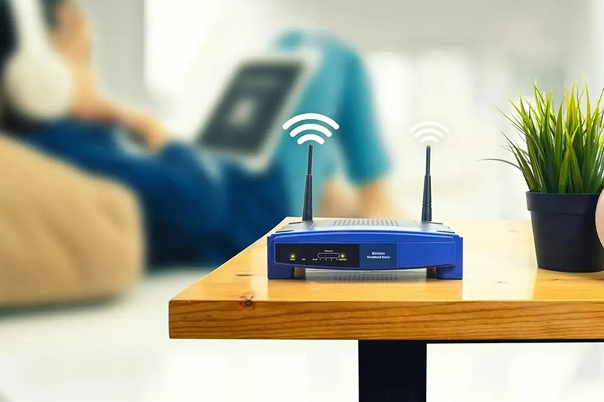
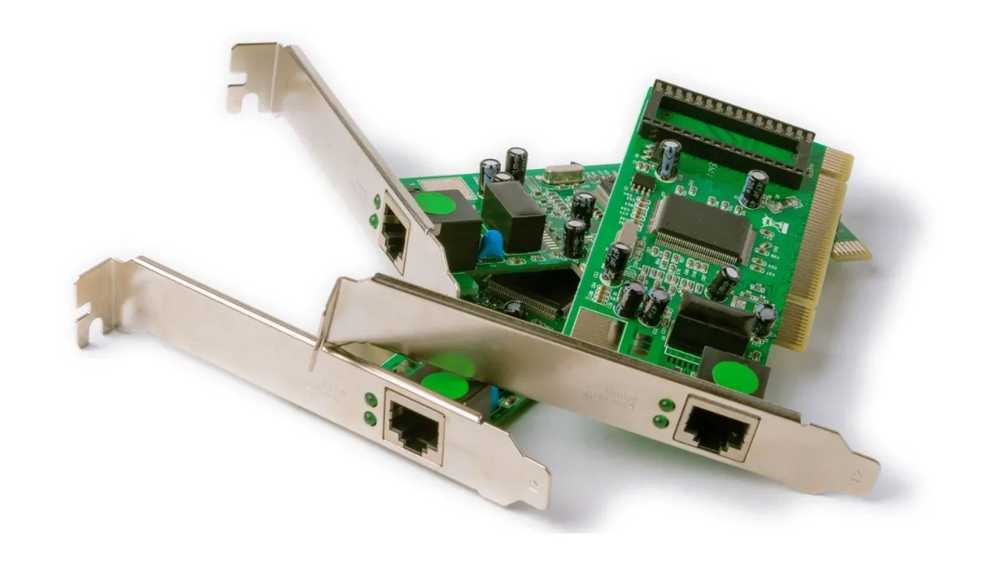

# TÌM HIỂU VỀ THIẾT BỊ MẠNG
## 1.  Firewall – Tường lửa

- Khái niệm:

Firewall là một hệ thống bảo mật mạng, có thể là phần mềm, phần cứng hoặc cả hai, có vai trò giám sát và kiểm soát lưu lượng dữ liệu ra vào dựa trên các quy tắc đã được thiết lập trước để tạo ra ranh giới an toàn giữa mạng nội bộ và Internet hoặc các mạng bên ngoài khác.
- Chức năng:
  - Bảo vệ khỏi tấn công mạng: Ngăn chặn tin tặc, virus, phần mềm độc hại và các hoạt động đáng ngờ khác xâm nhập vào hệ thống. 
  - Kiểm soát truy cập: Hạn chế quyền truy cập vào mạng hoặc các ứng dụng nhất định dựa trên các yếu tố như địa chỉ IP, cổng mạng, ứng dụng và giao thức. 
  - Bảo vệ dữ liệu nội bộ: Giúp bảo vệ thông tin và tài nguyên bên trong mạng khỏi các mối đe dọa từ bên ngoài. 
  - Tuân thủ chính sách bảo mật: Giúp doanh nghiệp và người dùng tuân thủ các chính sách bảo mật bằng cách kiểm soát chặt chẽ các luồng thông tin.
## 2. Hub

- Khái niệm:

Hub (hay bộ chia mạng) là một thiết bị mạng cơ bản hoạt động như một trung tâm kết nối, cho phép các thiết bị trong một mạng LAN (mạng cục bộ) giao tiếp với nhau bằng cách nhận dữ liệu từ một cổng và gửi lại tất cả các cổng khác, bất kể địa chỉ đích.
- Chức năng
  - Chia sẻ kết nối: Mở rộng mạng bằng cách chia sẻ một cổng mạng thành nhiều cổng.
  - Broadcast: Gửi dữ liệu đến tất cả các cổng.
- Nhược điểm:
  - Không thông minh: Hub không có khả năng phân biệt đích đến của dữ liệu, nó luôn gửi đến tất cả các cổng, gây lãng phí băng thông. 
  - Tắc nghẽn mạng: Khi có nhiều thiết bị cùng gửi dữ liệu hoặc lưu lượng mạng cao, Hub dễ gây ra hiện tượng tắc nghẽn do dữ liệu được phát tán đồng loạt. 
  - Hiệu suất thấp: Do hoạt động chia sẻ băng thông và khả năng gây xung đột, hiệu suất của mạng sử dụng Hub thường thấp hơn so với các thiết bị hiện đại như switch.
## 3. Bridge

- Khái niệm:

Bridge là một thiết bị mạng hoạt động ở tầng liên kết dữ liệu, có nhiệm vụ kết nối nhiều mạng LAN (mạng cục bộ) để mở rộng hoặc hợp nhất thành một mạng LAN lớn hơn.
- Chức năng
  - Kết nối nhiều mạng LAN, giúp tăng dung lượng và khả năng mở rộng mạng.
  - Quyết định chấp nhận hay từ chối gói dữ liệu dựa trên cơ sở dữ liệu nhận được.
  - Trong trường hợp địa chỉ đích hoặc địa chỉ MAC không tồn tại, Bridge vẫn có thể phát dữ liệu đi.
  - Khi một số nút gặp sự cố, Bridge vẫn đảm bảo chuyển tiếp các gói dữ liệu.
## 4. Switch – Bộ chuyển mạch

- Khái niệm:

là thiết bị mạng trung tâm kết nối các thiết bị khác nhau (như máy tính, máy in) trong một mạng LAN theo mô hình hình sao, cho phép chúng giao tiếp hiệu quả bằng cách nhận dữ liệu, đọc địa chỉ đích và chuyển tiếp gói dữ liệu trực tiếp đến thiết bị đó thay vì gửi đến tất cả các cổng như Hub.
- Đặc trưng cơ bản của Switch gồm:
  - Trong mô hình OSI, Switch hoạt động ở tầng thứ 2.
  - Switch được xem như một cầu nối mạng với nhiều cổng nối khác nhau.
  - Switch thực hiện công đoạn kiểm tra lỗi thật kỹ, sau đó chuyển dữ liệu đến cổng đích.
  - Switch dùng kỹ thuật chuyển mạch gói để truyền tải dữ liệu giữa các thiết bị trong mạng LAN.
## 5. Repeater – Bộ lặp tín hiệu

- Khái niệm:
Repeater là một thiết bị được dùng tái tạo và khuếch đại tín hiệu, giúp kéo dài khoảng cách truyền tín hiệu trong mạng mà không làm giảm chất lượng tín hiệu.. Vì vậy, Repeater còn được biết đến là bộ tăng cường tín hiệu.
- Chức năng
Chức năng chính của bộ lặp tín hiệu là đảm bảo chất lượng và độ an toàn của dữ liệu dù cho chúng có được truyền đi xa.
## 6. Router – Bộ định tuyến

- Khái niệm:

Router là thiết bị mạng chuyển tiếp các gói dữ liệu giữa các mạng máy tính khác nhau, giúp kết nối nhiều thiết bị và điều phối luồng dữ liệu trên Internet.
- Chức năng
  - **Chuyển tiếp dữ liệu:** Khi nhận được một gói dữ liệu tại một cổng vào, bộ định tuyến sẽ kiểm tra thông tin trong tiêu đề gói tin (đặc biệt là địa chỉ IP đích). Sau đó, nó tra cứu trong bảng định tuyến để tìm ra cổng ra tương ứng với địa chỉ IP đích và chuyển gói tin đến cổng đó.
  - **Thực hiện định tuyến:** Bộ định tuyến xác định đường đi tốt nhất cho gói dữ liệu từ nguồn đến đích. Quá trình này dựa trên các thuật toán định tuyến phức tạp, xem xét các yếu tố như khoảng cách, độ trễ, băng thông và tình trạng mạng.
## 7. Gateway – Cổng ghép nối

- Khái niệm:

Gateway (cổng mạng) là một thiết bị hoặc phần mềm đóng vai trò "cầu nối" giữa các mạng máy tính khác nhau, cho phép chúng giao tiếp với nhau bằng cách chuyển đổi và định tuyến dữ liệu giữa các giao thức, định dạng và cấu trúc khác nhau.
- Chức năng
  - **Nâng cao khả năng hiển thị:** Gateway cung cấp khả năng hiển thị vô song đối với các lượt truy cập đi qua nút ranh giới.
  - **Thực hiện thu thập dữ liệu:** Cổng ghép nối thu thập thông tin từ những vị trí khác của mạng, từ đó khắc phục sự cố nhanh chóng.
  - **Chế độ bảo mật được nâng cao:** Vị trí của các Gateway mang đến khả năng bảo mật cần thiết cho mọi dữ liệu khi đi từ hệ thống này sang hệ thống khác.
  - **Hỗ trợ đa giao thức:** Các cổng ghép nối được xây dựng để chứa đa dạng các giao thức. Điều đó giúp cho quá trình truyền hoặc sử dụng dữ liệu giữa các mạng được dễ dàng.
## 8. Access Point – Thiết bị mở rộng vùng phủ sóng Wifi

- Khái niệm:

**Access Point (AP)** là thiết bị mạng giúp các thiết bị không dây như điện thoại, laptop, máy tính bảng kết nối với mạng có dây (LAN) qua sóng Wi-Fi.
- Chức năng

  - **Tạo mạng Wi-Fi:** AP tạo ra các điểm truy cập (hotspot) để thiết bị không dây có thể kết nối và sử dụng mạng. 
  - **Kết nối mạng có dây và không dây:** AP chuyển đổi tín hiệu từ mạng có dây (Ethernet) thành tín hiệu không dây (Wi-Fi) và ngược lại. 
  - **Mở rộng phạm vi phủ sóng:** AP giúp mở rộng vùng phủ sóng Wi-Fi, đặc biệt hữu ích trong các không gian lớn như văn phòng, tòa nhà, khách sạn, hoặc các địa điểm công cộng. 
  - **Hỗ trợ nhiều thiết bị kết nối:** Một AP có thể cho phép nhiều thiết bị kết nối và sử dụng mạng cùng lúc. 
  - **Chuyển giao kết nối:** Khi một thiết bị di chuyển ra ngoài phạm vi phủ sóng của một AP, nó có thể tự động chuyển sang một AP khác để duy trì kết nối liền
## 9. Modem – Thiết bị kết nối mạng

- Khái niệm:

Modem là thiết bị phần cứng có tên viết tắt từ "Modulator-Demodulator", có chức năng chuyển đổi tín hiệu số (digital) từ máy tính sang tín hiệu tương tự (analog) để truyền đi qua các đường dây dẫn, và giải mã tín hiệu analog nhận được trở lại thành tín hiệu số để máy tính có thể hiểu.
- Chức năng
  - **Điều chế (Modulation):** Chuyển đổi dữ liệu số (dưới dạng 0 và 1) từ máy tính thành sóng tín hiệu tương tự để truyền đi trên đường truyền (như cáp điện thoại, cáp đồng trục, cáp quang).
  - **Giải điều chế (Demodulation):** Chuyển đổi ngược lại tín hiệu analog nhận được từ đường truyền thành dữ liệu số mà máy tính và các thiết bị khác có thể hiểu.
## 10. Network card – Card mạng

- Khái niệm:

**Network Card** là loại bảng mạch, bên trong có bo mạch chính, hỗ trợ các thiết bị giao tiếp với nhau thông qua Internet.
- Chức năng
  - Thực hiện quá trình giao tiếp thông tin giữa các thiết bị, đồng thời thống kê và quản lý mọi dữ liệu được truyền tới thiết bị.
  - Mỗi card mạng chứa một địa chỉ MAC nhất định và riêng biệt. Chính bởi địa chỉ này mà card mạng có thể phân định dữ liệu và thực hiện truyền đi một cách chuẩn xác.
