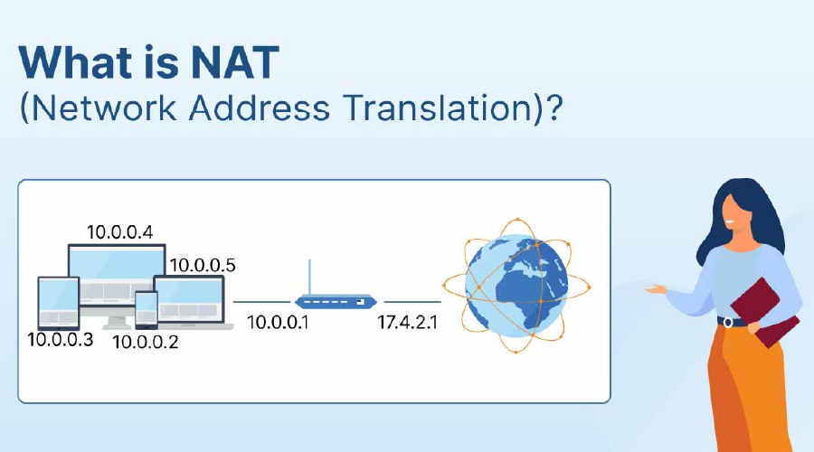
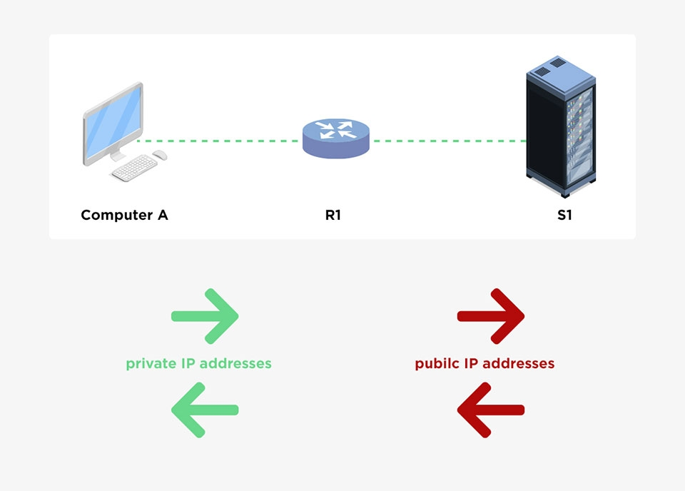
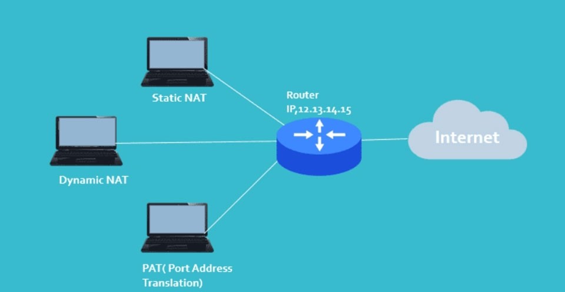

# TÌM HIỂU VỀ NAT
## I. Nat là gì?
NAT (Network Address Translation) là công nghệ dịch địa chỉ mạng, cho phép nhiều thiết bị trong mạng nội bộ sử dụng một địa chỉ IP công cộng duy nhất để truy cập Internet, giúp tiết kiệm IP và tăng cường bảo mật bằng cách ẩn các địa chỉ IP riêng tư.



## Chức năng chính của NAT


- **Chia sẻ địa chỉ IP Public:** NAT cho phép nhiều thiết bị trong mạng nội bộ (sử dụng địa chỉ IP Private) chia sẻ một hoặc một số địa chỉ IP Public để truy cập internet. Điều này rất quan trọng khi số lượng địa chỉ IP Public có hạn trong IPv4.
- **Tăng cường bảo mật:** NAT che giấu địa chỉ IP Private của các thiết bị trong mạng nội bộ khỏi internet, giúp bảo vệ mạng khỏi các cuộc tấn công bên ngoài. Thiết bị từ ngoài internet không thể kết nối trực tiếp với các thiết bị có IP Private mà không qua NAT.
- **Giảm bớt nhu cầu sử dụng địa chỉ IP Public:** Bằng cách sử dụng một hoặc một vài địa chỉ IP Public cho hàng trăm hoặc hàng nghìn thiết bị có IP Private, NAT giúp tiết kiệm đáng kể tài nguyên địa chỉ IP Public.
- **Dễ dàng cấu hình mạng nội bộ:** NAT cho phép thay đổi, cấu trúc lại địa chỉ IP Private trong mạng nội bộ mà không ảnh hưởng đến địa chỉ IP Public. Điều này tạo ra sự linh hoạt trong việc quản lý và tổ chức mạng nội bộ.
- **Hỗ trợ kết nối từ mạng nội bộ ra ngoài internet:** Khi một thiết bị trong mạng nội bộ muốn truy cập internet, NAT sẽ ánh xạ địa chỉ IP Private thành địa chỉ IP Public. Điều này cho phép các thiết bị trong mạng nội bộ có thể duy trì kết nối với các dịch vụ và hệ thống trên internet.

## Cách thức hoạt động của NAT
- **Gói tin ra ngoài:** Khi một thiết bị trong mạng LAN (ví dụ: máy tính của bạn) gửi yêu cầu ra Internet, gói tin sẽ đi qua router.
- **Thay đổi IP nguồn:** Router sẽ thay đổi địa chỉ IP nguồn của gói tin từ IP riêng tư của thiết bị trong mạng LAN thành địa chỉ IP công cộng của router.
- **Lưu trữ thông tin:** Router duy trì một bảng ghi lại thông tin về kết nối này, bao gồm IP nguồn (riêng tư), IP đích (công cộng) và các cổng kết nối.
- **Gói tin trả về:** Khi máy chủ trên Internet gửi gói tin trả lời, gói tin này sẽ đến router với địa chỉ IP đích là IP công cộng.
- **Thay đổi IP đích:** Router dựa vào bảng ghi nhớ của mình để thay đổi địa chỉ IP đích thành địa chỉ IP riêng tư của thiết bị trong mạng LAN ban đầu và chuyển gói tin đến đúng thiết bị đó.
## Phân loại NAT trong mạng


**NAT (Network Address Translation)** trong mạng có thể được phân loại thành 3 loại chính dựa trên cách thức thực hiện chuyển đổi địa chỉ IP:
- **Static NAT (NAT tĩnh):** Đây là loại NAT cơ bản nhất và thường được sử dụng để chuyển đổi một địa chỉ IP tĩnh trong mạng cục bộ sang một địa chỉ IP công cộng. Trong quá trình chuyển đổi, một địa chỉ IP tĩnh được ánh xạ với một địa chỉ IP công cộng, giúp thiết lập kết nối đến những thiết bị trong mạng cục bộ từ bên ngoài mạng.

**Cách cấu hình Stactic NAT như sau:**
- Thiết lập mối quan hệ chuyển đổi giữa địa chỉ IP cục bộ và IP Public ở ngoài:
```
Router (config) # ip nat inside source static [local ip] [global ip]
```
- Xác định các cổng kết nối với mạng cục bộ:
```
Router (config-if) # ip nat inside
```
- Xác định cổng kết nối với mạng bên ngoài với lệnh sau:
```
Router (config-if) # ip nat outside
```
Ví dụ:
```
Router (config) # ip nat inside source static 192.168.1.100 202.1.1.10
Router (config) # interface fa0/0
Router (config-if) # ip nat inside
Router (config) # interface s0/0/0
Router (config-if) # ip nat outside
```
  - Ưu điểm: Kết nối ổn định và cố định, hỗ trợ truy cập từ Internet vào LAN, dễ quản lý, không thay đổi địa chỉ
  - Nhược điểm: Lãng phí địa chỉ Public IP, không tăng bảo mật, không phù hợp cho người dùng cuối, khó mở rộng
- **Dynamic NAT (NAT động):** Đây là loại NAT phổ biến được sử dụng để chuyển đổi một địa chỉ IP động trong mạng cục bộ sang một địa chỉ IP công cộng. Trong quá trình chuyển đổi, NAT sẽ tạo ra một bảng ánh xạ động giữa những địa chỉ IP tĩnh và địa chỉ IP công cộng, cho phép những thiết bị trong mạng cục bộ chia sẻ cùng một địa chỉ IP công cộng.

**Cấu hình Dynamic NAT:**
- Xác định địa chỉ IP Public:
```
Router (config) # ip nat pool [name start ip] [name end ip] netmask [netmask]/prefix-lenght [prefix-lenght]
```
- Thiết lập ACL để tạo danh sách các địa chỉ Private được phép chuyển đổi IP:
```
Router (config) # access-list [access-list-number-permit] source [source-wildcard]
```
- Thiết lập mối quan hệ giữa địa chỉ nguồn và đại chỉ IP bên ngoài:
```
Router (config) # ip nat inside source list <acl-number> pool <name>
```
- Xác định cổng kết nối với mạng cục bộ:
```
Router (config-if) # ip nat inside
```
- Xác định cổng kết nối với mạng bên ngoài:
```
Router (config-if) # ip nat outside
```
Ví dụ
```
Router (config) # ip nat pool abc 202.1.1.177 202.1.1.185 netmask 255.255.255.0
Router (config) # access-list 1 permit 192.168.1.0  0.0.0.255
Router (config) # ip nat inside source list 1 pool abc
Router (config) # interface fa0/0
Router (config-if) # ip nat inside
Router (config) # interface s0/0/0
Router (config-if) # ip nat outside
```
  - Ưu điểm: Tiết kiệm công cấu hình, tận dụng tốt Public IP, thích hợp cho môi trường có nhiều máy nhưng không hoạt động cùng lúc
  - Nhược điểm: Không đảm bảo Public IP cố định cho mỗi thiết bị, Cần nhiều Public IP hơn so với PAT (NAT Overload).
- **Port Address Translation (PAT):** Đây là loại NAT phức tạp nhất và cũng là loại NAT phổ biến nhất. PAT cho phép chuyển đổi nhiều địa chỉ IP trong mạng cục bộ sang một địa chỉ IP công cộng thông qua nhiều cổng khác nhau. Mỗi kết nối từ những thiết bị trong mạng cục bộ được định tuyến thông qua một cổng duy nhất trên địa chỉ IP công cộng, giúp tiết kiệm địa chỉ IP công cộng và tăng cường bảo mật của mạng.

**Cấu hình NAT Overload hay gọi là PAT (Port Address Translation):**
- Xác định địa chỉ IP mạng nội bộ cần ánh xạ bên ngoài:
```
Router (config) # access-list <ACL-number> permit <source> <wildcard>
```
- Cấu hình để chuyển IP đến cổng kết nối bên ngoài:
```
Router (config) # ip nat inside source list <ACL-number> interface <interface> overload
```
- Xác định nết nối với mạng nội bộ:
```
Router (config-if) # ip nat inside
```
- Xác định các cổng kết nối với mạng bên ngoài:
```
Router (config-if) # ip nat outside
```
Ví dụ:
```
Router (config) # access-list <ACL-number> permit <source> <wildcard>
Router (config) # ip nat inside source list <ACL-number> interface <interface> overload
Router (config-if) # ip nat inside
Router (config-if) # ip nat outside
```
  - Ưu điểm: Tiết kiệm địa chỉ IP Public tối đa, Phổ biến nhất, dễ triển khai, Tăng tính bảo mật
  - Nhược điểm: Giới hạn số lượng kết nối đồng thời, Khó khăn cho một số ứng dụng, Không phù hợp cho dịch vụ công khai.
## Ưu và nhược điểm của NAT
- **Ưu điểm:**
  - **Bảo mật tốt hơn:** NAT có khả năng ẩn IP nội bộ khỏi các IP công cộng. Điều này hữu ích để năng chặn các cuộc tấn công nhắm vào địa chỉ IP hoặc ngăn chặn các thiết bị nội bộ truy cập các trang web độc hại không mong muốn.
  - **Tốc độ tốt hơn:** NAT có thể giúp cải thiện tốc độ liên lạc bằng cách giảm số lượng gói tin cần định tuyến.
  - **Tính linh hoạt:** NAT mang lại sự linh hoạt cho các tổ chức muốn thay đổi cấu hình mạng mà không thay đổi địa chỉ IP.
  - **Tiết kiệm địa chỉ IP:** Một số nhà cung cấp dịch vụ internet (ISP) quy định một số lượng IP hạn chế. Do đó, NAT là lựa chọn tối ưu giúp tiết kiệm không gian địa chỉ IP bằng cách cho phép nhiều thiết bị chia sẻ một địa chỉ IP duy nhất.
  - **Tiết kiệm chi phí:** Việc giảm địa chỉ IP sẽ giúp tổ chức tiết kiệm tiền mua giấy phép địa chỉ IP và chi phí liên quan khác.
  - **Quản trị mạng dễ dàng hơn:** Số lượng địa chỉ IP ít đồng nghĩa với việc quản lý dễ dàng hơn giúp tiết kiệm thời gian và công sức cho việc quản lý hệ thống mạng.
- **Nhược điểm:**
  - **Tăng độ phức tạp của mạng:** NAT có thể gây ra sự cố tương thích với một số loại thiết bị và phần mềm mạng bởi việc chuyển đổi IP riêng thành IP công cộng và ngược lại là một vấn đề đau đầu. Hơn nữa NAT cũng có thể cản trở một số loại ứng dụng mạng nhất định như VoIP, hội nghị truyền hình, ứng dụng yêu cầu kết nối trực tiếp,…
  - **Hạn chế kết nối:** NAT có thể giới hạn việc thiết lập một số loại kết nối nhất định. Ngoài ra, nó còn có thể giao tiếp với các biện pháp an ninh mạng như tường lửa, hệ thống phát hiện xâm nhập nên có thể gây che khuất nguồn và đích thực sự của lưu lượng mạng. Điều này làm cho việc xác định và giải quyết các mối đe dọa bảo mật trở nên khó khăn hơn.
  - **Thiếu kết nối đầu cuối:** NAT có thể chặn các kết nối đầu cuối giữa các thiết bị bởi vì độ trễ ngày càng tăng do quá trình xử lý trong việc chuyển đổi IP riêng tư sang công khai và ngược lại.
  - **Khó khăn trong việc xác thực địa chỉ IP:** NAT có thể khiến việc xác thực địa chỉ IP trở nên khó khăn vì nhiều thiết bị trên mạng riêng chia sẻ cùng một địa chỉ IP công cộng nên việc xác định từng thiết bị riêng lẻ có thể gặp khó khăn.
## Cơ chế hoạt động của NAT
Các bước chính trong quá trình hoạt động của NAT:
- **Gói tin từ mạng nội bộ:** Khi một thiết bị (ví dụ: máy tính, điện thoại) trong mạng nội bộ muốn truy cập Internet, nó sẽ tạo ra một gói tin chứa địa chỉ IP riêng của nó (IP Private) làm địa chỉ IP nguồn.
- **Gói tin đến bộ định tuyến NAT:** Gói tin này sẽ được gửi đến bộ định tuyến có chức năng NAT.
- **Chuyển đổi địa chỉ IP nguồn:** Bộ định tuyến NAT sẽ thay thế địa chỉ IP nguồn Private của thiết bị nội bộ bằng địa chỉ IP công cộng (IP Public) của chính bộ định tuyến.
- **Lưu thông tin vào bảng NAT:** Đồng thời, bộ định tuyến sẽ ghi lại cặp địa chỉ IP nguồn Private và địa chỉ IP công cộng vào bảng NAT để sử dụng cho các gói tin phản hồi sau này.
- **Gửi gói tin ra Internet:** Gói tin đã được chuyển đổi địa chỉ sẽ được gửi đến máy chủ đích trên Internet.
- **Nhận phản hồi từ Internet:** Khi máy chủ đích gửi phản hồi, nó sẽ gửi gói tin đến địa chỉ IP công cộng của bộ định tuyến NAT.
- **Chuyển đổi ngược lại:** Bộ định tuyến NAT sẽ tra cứu trong bảng NAT, tìm địa chỉ IP nguồn Private tương ứng với địa chỉ IP công cộng đó và chuyển đổi lại địa chỉ IP nguồn của gói tin.
- **Chuyển gói tin đến thiết bị nội bộ:** Cuối cùng, gói tin đã được dịch ngược sẽ được chuyển đến đúng thiết bị trong mạng nội bộ đã gửi yêu cầu ban đầu.


